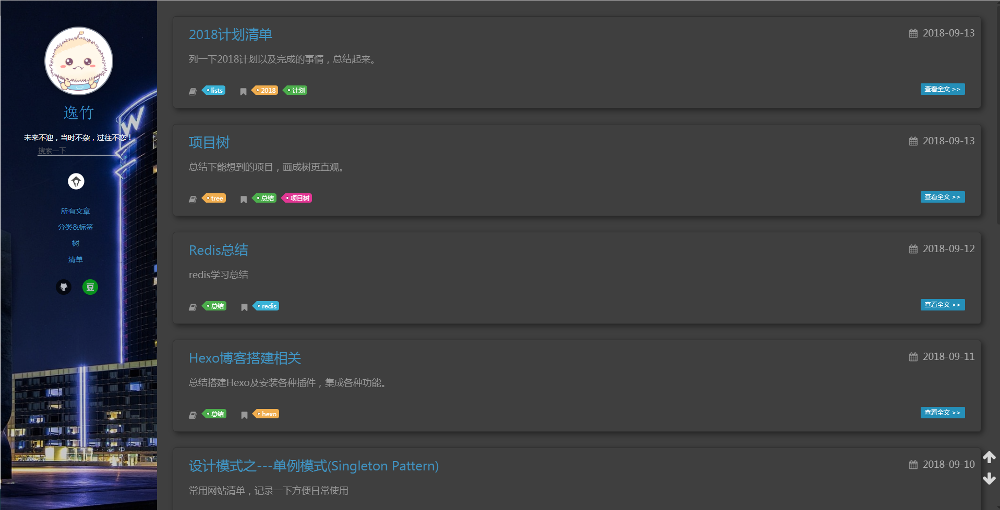
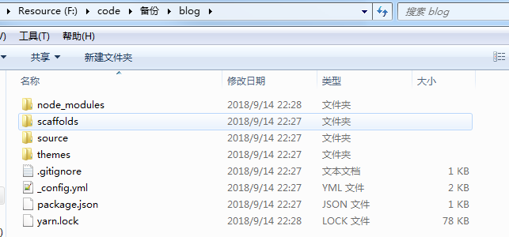
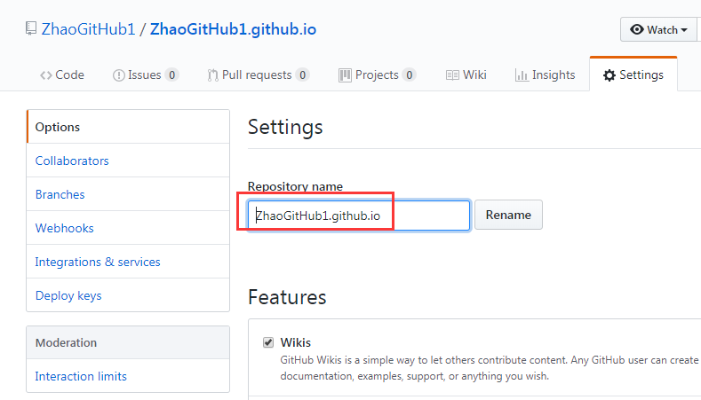
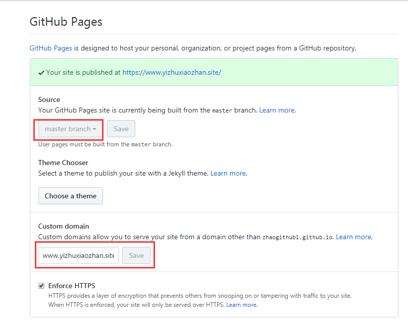

** {{ title }}：** <Excerpt in index | 首页摘要>

<!-- more -->
<The rest of contents | 余下全文>


> 本文默认已经安装好`git`和`node.js`环境
>
> 版本说明：`git version 2.16.2.windows.1` 、` node.js v8.9.4`

## Hexo是什么

　　Hexo 是一个快速、简洁且高效的博客框架，这里不多介绍，丢个链接，感兴趣的自己去看吧：[Hexo中文官网](https://hexo.io/zh-cn/)，里面的东西比较多，不光有hexo使用文档，还有众多的hexo插件和主题。

## 我的Hexo博客主页效果图

欢迎来访~[逸竹小站](https://userzhao.coding.me/)



## 安装Hexo

```shell
$ npm install -g hexo-cli
```

## 建立默认主题博客

```shell
$ hexo init blog
$ cd blog
$ npm install
```

>  `blog`为博客存储文件夹名称，可随意命名，本文以`blog`为例。最好命名与GitHub Pages仓库名称一致，省的后面修改，不过都是小case



> 因为要下载文件，而且是从github下载，如果可以“科学上网”，可以开一下。
>
> 此时打开`localhost:4000`即可看到默认主题的Hexo博客

## 选择主题

在[官网-主题](https://hexo.io/themes/)里面有200+的主题可供选择，我推荐几款个人比较喜欢的

- 简约款
  - [**hexo-theme-next**](https://github.com/iissnan/hexo-theme-next)
  - [**maupassant-hexo**](https://github.com/tufu9441/maupassant-hexo)
  - [**hexo-theme-melody**](https://github.com/Molunerfinn/hexo-theme-melody)
- 炫酷款
  - [**black-blue**](https://github.com/maochunguang/black-blue)
  - [**hexo-theme-nebula**](https://github.com/Suolawangzai/hexo-theme-nebula)
- 实用款
  - [**hexo-theme-pure**](https://github.com/cofess/hexo-theme-pure)

## 应用主题

　　选择好主题后，进入对应的github项目主页，一般都会有README文件帮助完成后续搭建，若无可以参考下面步骤进行，进入之前搭建好的博客主题文件目录下（本文为：blog/themes/），检出主题文件

```shell
$ git clone https://github.com/xxxx
```

　　然后修改博客配置文件`_config.yml`，添加下面这行

```
theme: xxx
```

> 注意：①`xxx`为主题名称
>
> ②不是主题的配置文件哦，在博客文件夹根目录下

## 配置文件详解

　　搭建整个博客过程中有两个配置文件，非常重要，一个是博客配置文件，一个是主题配置文件分别存放在各自的根目录下，文件名均为`_config.yml`

博客配置文件

```yml
# Hexo 配置

# Site
title: Hexo		# Hexo博客网站标题
subtitle:		# Hexo博客网站子标题
description:	# Hexo博客网站描述
keywords:		# Hexo博客关键词
author: John Doe	# 作者
language:			# 语言
timezone:			# 时区

# URL
url: http://yoursite.com	# 网站网址
root: /						# 网站根目录
permalink: :year/:month/:day/:title/	# 文章永久链接格式
permalink_defaults:			# 永久链接每部分默认值，一般不设置

# Directory
source_dir: source		# 资源文件存储目录
public_dir: public		# 公共文件夹，静态网站生成目录
tag_dir: tags			# 标签目录
archive_dir: archives	# 文章目录
category_dir: categories	# 分类目录
code_dir: downloads/code	# 代码目录
i18n_dir: :lang			# i18n国际化
skip_render:

# Writing
new_post_name: :title.md 	# 新博客文件名格式
default_layout: post		# 默认布局
titlecase: false 			# 是否标题小写
external_link: true 		# 是否在新的标签页打开链接
filename_case: 0			# 转换文件名1：小写，2：大写
render_drafts: false		# 显示草稿
post_asset_folder: false	# 
relative_link: false		# 是否是用相对路径作为连接
future: true				# 是否展示未来的文章
highlight:					# 代码高亮设置
  enable: true
  line_number: true
  auto_detect: false
  tab_replace:
  
# Home page setting
index_generator:		# 主页设置
  path: ''				# 博客根目录
  per_page: 10			# 分页大小
  order_by: -date		# 排序，默认日期
  
# Category & Tag
default_category: uncategorized	# 默认分类
category_map:			# 分类集合
tag_map:				# 标签集合

# Date / Time format
date_format: YYYY-MM-DD	# 日期格式
time_format: HH:mm:ss	# 时间格式

# Pagination
per_page: 10			# 分页大小
pagination_dir: page	# 分页目录

# Extensions
theme: landscape		# 主题

# Deployment
deploy:					# 部署
  type:					# 类别：git
```

　　主题配置文件，这个是[**black-blue**](https://github.com/maochunguang/black-blue)主题的配置文件，已经比较详细了，直接贴上来了

```yml
# >>> Basic Setup | 基础设置 <<<

# Header | 主菜单
## About Page: `hexo new page about`
## Tags Cloud Page: `hexo new page tags`
menu:
  # 主页: /archives/
  所有文章: /archives/
  玩转开发工具: /categories/开发工具/
  玩转数码: /categories/digital
  算法学习: /categories/algorithm
  关于我: /about/
# 静心阅读: /tags

# Link to your avatar | 填写头像地址
avatar: /img/avatar.png

# Small icon of Your site | 站点小图标地址
favicon: /img/favicon.png

# 域名是否启用https，如果启用，js文件必须https加载
isHttps: true

# Social info. Bar | 社交信息展示
## Keep "mailto:" in Email | 设置 Email 时保留 "mailto:"
## Encrypt email 加密邮件地址 http://ctrlq.org/encode/
## RSS requires a plugin to take effect | 使用 RSS 需先安装对应插件
## https://github.com/hexojs/hexo-generator-feed
subnav:
  github: xxxxx
  weibo: xxxxxxxx
  rss: /atom.xml

  # Google: "#"
# search_box: true

# >>> Conments 评论系统 <<<

disqus:
  on: false
  shortname: xxxxxxxxx
  # https://help.disqus.com/customer/en/portal/articles/466208-what-s-a-shortname-
  # It is unnecessary to enable disqus here if
  # you have set "disqus_shortname" in your site's "_config.yml"
changyan:
  on: true
  appid: xxxx
  conf: xxxxxxxxx
  # 是否开启畅言评论，
  # id 中填写你的友言用户数字ID，注册后进入后台管理即可查看
  # 畅言评论在 Web 环境下运行，普通本地环境无法查看，请部署后在线上测试。
gitment:
  on: true
  githubID: yourid
  repo: yourrepo
  client_id: yourid
  client_secret: yoursecret
  lazy: true

# >>> Style Customisation 样式自定义 <<<

# Background | 背景
## "background_sum": show images form /source/background/的图片数目
## "on: true": 自动随机显示这5张图片
## "on: false": 自定义显示图片设置background_image: 5
background:
  on: true
  background_sum: 1
  background_image: 1

highlight_style:
  on: true
  inline_code: 3  # Value: 0 - 9 可选
  code_block: 2  # Value: 0 - 4
  # Set inline_code to style highlight text
  # Chose a highlight theme for code block
  # 通过 inline_code 切换内置文本高亮样式
  # 通过 code_block 切换内置代码高亮配色主题

blockquote_style:
  #on: true
  blockquote: 5  # Value: 0 - 7 可选
  # 自定义文章「引用部分」的样式

# 左边栏宽度 px
left_col_width: 300

# 目录中标题不换行
# Keep TOC title on the same line |
toc_nowrap: false

# 自定义"阅读全文"链接按钮的显示文字
# Customize the text on excerpt link
excerpt_link: 查看更多 #修改more>>的文字

# 是否显示边栏中的搜索框（站内搜索）
# Search Box in left column
search_box: true

# 是否开启主页及加载头像时的动画效果
# Animation in Homepage and Loading avatar
animate: true

# >>> Small features | 小功能设置 <<<

# 是否开启边栏多标签切换
# Birdhouse button in left column
tagcloud: true

# Blogroll, Link exchange | 友情链接
# friends: false
friends:
  csdn: http://blog.csdn.net/baidu_21483933
  segmentfault: https://segmentfault.com/blog/maocg_web
  简书: http://www.jianshu.com/users/eb37ef89c746/latest_articles
#是否开启“关于我”。
aboutme: 爱动漫,爱游戏,爱编程,爱运动,爱的太多了!
#aboutme: false

# 是否在新窗口打开链接
open_in_new: false

# Customize feed link 自定义订阅地址
rss: /atom.xml

# >>> Vendors | 第三方工具 & 服务 <<<

# images viewer | 图片浏览器
## http://www.fancyapps.com/fancybox/
fancybox: true

# Display Math(LaTeX, MathML...) | 数学公式支持
## https://www.mathjax.org/
mathjax: false

# Socail Share | 是否开启分享
# share: true
baidushare: true
#showshare: true

# 百度、谷歌站长验证。填写 HTML 标签 content
# Site Verification for Google and Baidu. HTML label content.
# google_site: # pFW527fHrjfI0si2w4NQ0w3cTw12AvvuohAu1PUfqKA
# baidu_site: #c167b9feb4f0b208b712c79629c188e4

# Fill in Google Analytics tracking ID, #e.g. UA-XXXXX-X, or Baidu Analytics hash key
google_analytics: xxxxx
baidu_analytics: xxxxxx

# 不蒜子网站计数设置
# http://ibruce.info/2015/04/04/busuanzi/
visit_counter:
  on: true
  site_visit: 极客到访数
  page_visit: 本页阅读量

# A标签提示
TipTitle: true

# Loading
# Loading: true
```

## 日常产出博客

### 写作

#### 新建文章

```shell
$ hexo new [layout] <title>
```

	您可以在命令中指定文章的布局（layout），默认为 `post`，可以通过修改 `_config.yml` 中的 `default_layout` 参数来指定默认布局。

```shell
$ hexo new photo "My Gallery"
```

	在执行这行指令时，Hexo 会尝试在 scaffolds 文件夹中寻找 photo.md，并根据其内容建立文章，所以可以新建几个博客模板文件放置在 scaffolds 文件夹下。

我用的博客模板为：

```markdown
---
title: {{ title }}
categories: 分类
tags: 
  - 标签
date: {{ date }}
description: 描述
---

** {{ title }}：** <Excerpt in index | 首页摘要>

<!-- more -->
<The rest of contents | 余下全文>
```

#### 新建页面

```shell
$ hexo new [layout] <title>
```

### 本地启动

```shell
$ hexo s[erver]
INFO  Start processing
INFO  Hexo is running at http://localhost:4000 . Press Ctrl+C to stop.
```

　　启动之后http://localhost:4000 即可看到效果

### 本地调试

```shell
$ hexo s[erver] --debug
```

　　进入调试模式，可以看到详细的启动日志，包含hexo版本、工作目录、插件、博客目录、静态文件等信息，同时访问调试博客时还可以看到各资源响应状态和时间等信息。这种模式下调试博客样式及特效非常方便。

### 提交文件到github

```shell
$ git add .
$ git commit -m "提交备注"
```

　　即可提交到本地仓库，不熟悉git命令的可以查看我的另一篇博文[Git命令汇总](https://www.yizhuxiaozhan.site/2018/09/27/git-commands/)

### GitHub Pages配置



>这里仓库名称有两种命名方式：
>
>①github账户的 `用户名`+`github.io`，这种仓库访问地址为:`https://用户名.github.io/`
>
>②随意命名只要与你其他仓库名称不冲突即可，例如`hexo-blog`，则访问地址为：`https://github.com/`+`用户名`+`/hexo-blog/`
>
>大多数都会选择第一种格式创建仓库



> ①GitHub Page仓库资源文件必须存放master分之
>
> ②下面可以配置自己的域名，配置之后会在仓库根目录生成`CNAME`文件，同时要将域名解析到仓库访问地址

### 连接本地仓库和远程仓库

　　**将本地博客文件夹名称改为与仓库名称一致**，然后将二者关联

```shell
$ git remote git@github.com:用户名/仓库名.git
```

### 部署到Hexo远程仓库

```shell
$ hexo c[lean]
$ hexo g[enerate]
$ hexo d[eploy]
```

> hexo命令支持简写，条件是只有一个匹配项，egs：当安装了`hexo-douban` 之后执行`hexo d`就需要区分`hexo deploy`和`hexo douban`这两个命令了，可以分别使用`hexo de`和`hexo do`来调用

部署完成之后即可在上面设置的访问地址中看到效果了。

## Hexo插件推荐

与主题一样，[官方-插件](https://hexo.io/plugins/)也收录了200余种插件，这里推荐几款个人喜欢的

- [hexo-cli](https://github.com/hexojs/hexo-cli)：Hexo命令行基础插件
- [hexo-server](https://github.com/hexojs/hexo-server)：基础插件
- [hexo-deployer-git](https://github.com/hexojs/hexo-deployer-git)：git支持基础插件

- [hexo-douban](https://github.com/mythsman/hexo-douban)：分享豆瓣读书、电影、游戏的豆瓣秀插件
- [hexo-admin](https://github.com/jaredly/hexo-admin)：插件版博客后台管理系统
- [hexo-admin-ehc](https://github.com/lwz7512/hexo-admin-ehc)：hexo-admin增强版
- [hexo-auto-category](https://github.com/xu-song/hexo-auto-category)：根据文件夹自动生成分类
- [hexo-auto-excerpt](https://github.com/ashisherc/hexo-auto-excerpt)：自动摘录标签
- [hexo-generator-search](https://github.com/wzpan/hexo-generator-search)：提供搜索支持
- [hexo-generator-sitemap](https://github.com/hexojs/hexo-generator-sitemap)：生成sitemap

## 豆瓣插件

　　这款插件貌似对于我正在用的主题插件(black-blue)支持的不是很好，要修改很多东西，我直接弃用了，但是这款插件的还是不错的，所以推荐下。

### 安装

```shell
$ npm install hexo-douban --save
```

### 配置

```yml
douban:
  user: myDoubanID
  builtin: false
  book:
    title: 'This is my book title'
    quote: 'This is my book quote'
  movie:
    title: 'This is my movie title'
    quote: 'This is my movie quote'
  game:
    title: 'This is my game title'
    quote: 'This is my game quote'
  timeout: 10000 
```

- **user**: 你的豆瓣ID.打开豆瓣，登入账户，然后在右上角点击 "个人主页" ，这时候地址栏的URL大概是这样："<https://www.douban.com/people/xxxxxx/>" ，其中的"xxxxxx"就是你的个人ID了。
- **builtin**: 是否将生成页面的功能嵌入`hexo s`和`hexo g`中，默认是`false`,另一可选项为`true`(1.x.x版本新增配置项)。
- **title**: 该页面的标题.
- **quote**: 写在页面开头的一段话,支持html语法.
- **timeout**: 爬取数据的超时时间，默认是 10000ms ,如果在使用时发现报了超时的错(ETIMEOUT)可以把这个数据设置的大一点。

### 使用

```shell
$ hexo douban
或
$ hexo douban -h
Usage: hexo douban

Description:
Generate pages from douban

Options:
  -b, --books   Generate douban books only
  -g, --games   Generate douban games only
  -m, --movies  Generate douban movies only
```

### 菜单

　　如果上面的显示没有问题就可以在主题的配置文件 `_config.yml` 里添加如下配置来为这些页面添加菜单链接.

```yml
menu:
  Home: /
  Archives: /archives
  Books: /books     #This is your books page
  Movies: /movies   #This is your movies page
  Games: /games   #This is your games page
```