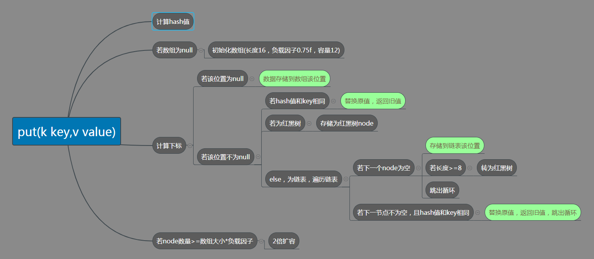
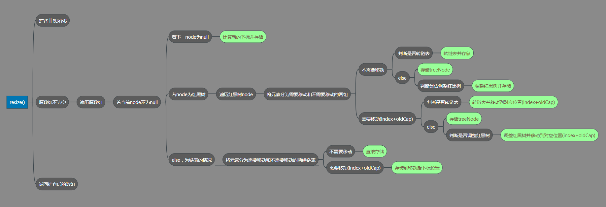

** {{ title }}：** <Excerpt in index | 首页摘要>

<!-- more -->
<The rest of contents | 余下全文>


# HashMap源码阅读笔记

> 版本说明：jdk 1.8

## 源码分析

- 继承关系

```java
public class HashMap<K,V> extends AbstractMap<K,V>
    implements Map<K,V>, Cloneable, Serializable
```

- 默认初始大小：16

```java
static final int DEFAULT_INITIAL_CAPACITY = 1 << 4; // aka 16
```

- 最大容量：2的30次幂

```java
static final int MAXIMUM_CAPACITY = 1 << 30;
```

- 默认负载因子：0.75f

```java
static final float DEFAULT_LOAD_FACTOR = 0.75f;
```

- 当链表的长度大于8时，转为红黑树存储，反过来小于6时，转为链表存储

```java
static final int TREEIFY_THRESHOLD = 8;
static final int UNTREEIFY_THRESHOLD = 6;
```

- 真正存储数据的node，存储该节点的hash值，key，value和链表的下一节点，并重写了`hashCode()`、`equals()`和`toString()`方法

```java
static class Node<K,V> implements Map.Entry<K,V> {
    final int hash;
    final K key;
    V value;
    Node<K,V> next;

    Node(int hash, K key, V value, Node<K,V> next) {
        this.hash = hash;
        this.key = key;
        this.value = value;
        this.next = next;
    }

    public final K getKey()        { return key; }
    public final V getValue()      { return value; }
    public final String toString() { return key + "=" + value; }

    public final int hashCode() {
        return Objects.hashCode(key) ^ Objects.hashCode(value);
    }

    public final V setValue(V newValue) {
        V oldValue = value;
        value = newValue;
        return oldValue;
    }

    public final boolean equals(Object o) {
        if (o == this)
            return true;
        if (o instanceof Map.Entry) {
            Map.Entry<?,?> e = (Map.Entry<?,?>)o;
            if (Objects.equals(key, e.getKey()) &&
                Objects.equals(value, e.getValue()))
                return true;
        }
        return false;
    }
}
```

- 计算hash值的方法：key的hashcode()高16位不变，低16位与高16位异或

```java
static final int hash(Object key) {
    int h;
    return (key == null) ? 0 : (h = key.hashCode()) ^ (h >>> 16);
}
```

- 返回大于等于 cap 对应的最小2的 n 次幂
  - cap-1再赋值给n的目的是令找到的目标值大于或等于原值。如果cap本身是2的幂，如8，不对它减1而直接操作，将得到16
  - 移位操作，会使cap的二进制从最高位的1到末尾全部置为1

```java
static final int tableSizeFor(int cap) {
        int n = cap - 1;
        n |= n >>> 1;
        n |= n >>> 2;
        n |= n >>> 4;
        n |= n >>> 8;
        n |= n >>> 16;
        return (n < 0) ? 1 : (n >= MAXIMUM_CAPACITY) ? MAXIMUM_CAPACITY : n + 1;
    }
```

- 四个构造方法
  - 指定初始大小和负载因子
  - 指定初始大小，负载因子使用默认值0.75f
  - 空构造方法
  - 接收一个map的构造方法，负载因子为0.75f，大小由map决定
- put方法
  - 先根据hash算法计算hash值
  - 初始化大小
  - 计算下标位置（与运算，速度快），判断是否存在元素
    - 为空，则存储node节点
    - 不为空
      - 若hash值和key相同，则替换原值，返回旧值
      - 若为红黑树，则存储为红黑树node
      - 否则，遍历链表
        - 若下一个node为空，存到该节点
          - 若长度>=8，转换成红黑树存储
        - 若下一节点不为空，且hash值和key相同，则替换原值，返回旧值
  - 判断node数量是否达到数组大小*负载因子，达到则扩容2倍



```java
public V put(K key, V value) {
        return putVal(hash(key), key, value, false, true);
    }

final V putVal(int hash, K key, V value, boolean onlyIfAbsent,
                   boolean evict) {
        Node<K,V>[] tab; Node<K,V> p; int n, i;
        if ((tab = table) == null || (n = tab.length) == 0)
            n = (tab = resize()).length;
        if ((p = tab[i = (n - 1) & hash]) == null)
            tab[i] = newNode(hash, key, value, null);
        else {
            Node<K,V> e; K k;
            if (p.hash == hash &&
                ((k = p.key) == key || (key != null && key.equals(k))))
                e = p;
            else if (p instanceof TreeNode)
                e = ((TreeNode<K,V>)p).putTreeVal(this, tab, hash, key, value);
            else {
                for (int binCount = 0; ; ++binCount) {
                    if ((e = p.next) == null) {
                        p.next = newNode(hash, key, value, null);
                        if (binCount >= TREEIFY_THRESHOLD - 1) // -1 for 1st
                            treeifyBin(tab, hash);
                        break;
                    }
                    if (e.hash == hash &&
                        ((k = e.key) == key || (key != null && key.equals(k))))
                        break;
                    p = e;
                }
            }
            if (e != null) { // existing mapping for key
                V oldValue = e.value;
                if (!onlyIfAbsent || oldValue == null)
                    e.value = value;
                afterNodeAccess(e);
                return oldValue;
            }
        }
        ++modCount;
        if (++size > threshold)
            resize();
        afterNodeInsertion(evict);
        return null;
    }
```

- 扩容，重新分配node位置

  - 当数组未初始化，按照之前在threashold中保存的初始容量分配内存，没有就使用缺省值
  - 当超过限制时，就扩充两倍，因为我们使用的是2次幂的扩展，所以，元素的位置要么是在原位置，要么是在原位置再移动原数组大小的位置

  > 1. 进行扩容，会重新进行内存分配，并且会遍历hash表中所有的元素，是非常耗时的。在编写程序中，要尽量避免resize
  > 2. 扩容期间如果并发操作会存在线程安全问题



```java
final Node<K,V>[] resize() {
        Node<K,V>[] oldTab = table;
        int oldCap = (oldTab == null) ? 0 : oldTab.length;
        int oldThr = threshold;
        int newCap, newThr = 0;
        if (oldCap > 0) {
            if (oldCap >= MAXIMUM_CAPACITY) {
                threshold = Integer.MAX_VALUE;
                return oldTab;
            }
            else if ((newCap = oldCap << 1) < MAXIMUM_CAPACITY &&
                     oldCap >= DEFAULT_INITIAL_CAPACITY)
                newThr = oldThr << 1; // double threshold
        }
        else if (oldThr > 0) // initial capacity was placed in threshold
            newCap = oldThr;
        else {               // zero initial threshold signifies using defaults
            newCap = DEFAULT_INITIAL_CAPACITY;
            newThr = (int)(DEFAULT_LOAD_FACTOR * DEFAULT_INITIAL_CAPACITY);
        }
        if (newThr == 0) {
            float ft = (float)newCap * loadFactor;
            newThr = (newCap < MAXIMUM_CAPACITY && ft < (float)MAXIMUM_CAPACITY ?
                      (int)ft : Integer.MAX_VALUE);
        }
        threshold = newThr;
        @SuppressWarnings({"rawtypes","unchecked"})
            Node<K,V>[] newTab = (Node<K,V>[])new Node[newCap];
        table = newTab;
        if (oldTab != null) {
            for (int j = 0; j < oldCap; ++j) {
                Node<K,V> e;
                if ((e = oldTab[j]) != null) {
                    oldTab[j] = null;
                    if (e.next == null)
                        newTab[e.hash & (newCap - 1)] = e;
                    else if (e instanceof TreeNode)
                        ((TreeNode<K,V>)e).split(this, newTab, j, oldCap);
                    else { // preserve order
                        Node<K,V> loHead = null, loTail = null;
                        Node<K,V> hiHead = null, hiTail = null;
                        Node<K,V> next;
                        do {
                            next = e.next;
                            if ((e.hash & oldCap) == 0) {
                                if (loTail == null)
                                    loHead = e;
                                else
                                    loTail.next = e;
                                loTail = e;
                            }
                            else {
                                if (hiTail == null)
                                    hiHead = e;
                                else
                                    hiTail.next = e;
                                hiTail = e;
                            }
                        } while ((e = next) != null);
                        if (loTail != null) {
                            loTail.next = null;
                            newTab[j] = loHead;
                        }
                        if (hiTail != null) {
                            hiTail.next = null;
                            newTab[j + oldCap] = hiHead;
                        }
                    }
                }
            }
        }
        return newTab;
    }
```

## 总结

1. Java8中hash计算是通过key的hashCode()的高16位异或低16位实现的，既保证高低bit都能参与到hash的计算中，又不会有太大的开销。
2. 数组大小n总是2的整数次幂，计算下标时直接( hash & n-1)
3. 分配内存统一放在resize()中，包括创建后首次put时初始化数组和存放元素个数超过阈值时扩容。
4. Java8引入红黑树，当链表长度达到8， 执行treeifyBin，当桶数量达到64时，将链表转为红黑树，否则，执行resize()。
5. 判断Node是否符合，首先判断哈希值要相等，但因为哈希值不是唯一的，所以还要对比key是否相等，最好是同一个对象，能用＝＝对比，否则要用equals()

## 建议

1. String类型的key，不能用==判断或者可能有哈希冲突时，尽量减少长度
2. 在集合视图迭代的时间与桶的数量加上映射的数量成正比，若迭代性能很重要，不要设置太高的初始容量或过小的负载因子
3. 如果映射很多，创建HashMap时设置充足的初始容量(预计大小/负载因子 + 1）会比让其自动扩容获得更好的效率，一方面减少了碰撞可能，另一方面减少了resize的损耗
4. 迭代器是fail-fast的，迭代器创建后如果进行了结构修改（增加或删除一个映射）且不是使用iterator的remove方法，会努力抛出`ConcurrentModificationException`，所以不能依赖该异常保证程序运行正确，而只可用于检测bug

## 面试考察点

1. 数组+单向链表（红黑树）
2. hash算法
3. put过程
4. 扩容过程
5. 为什么2倍扩容
6. 线程不安全原因
7. 有哪些改进的点

>参考链接：
>
>https://blog.csdn.net/qazwyc/article/details/76686915