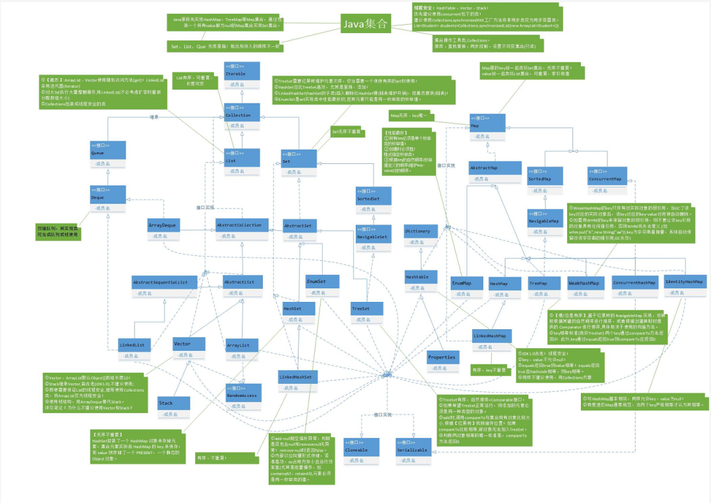
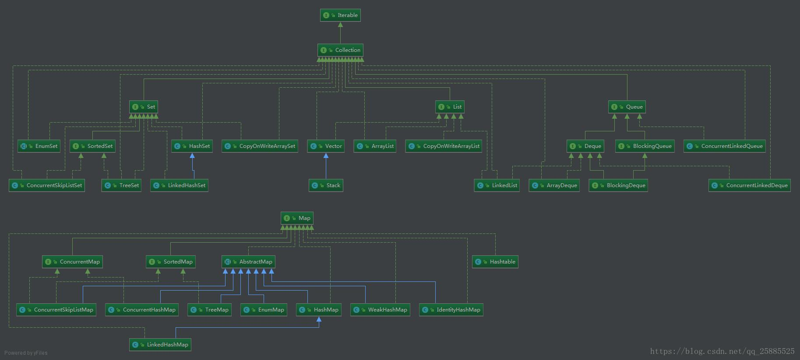
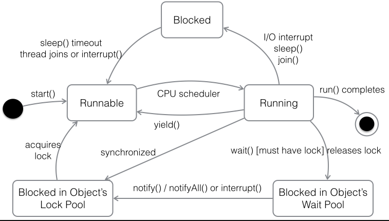

** {{ title }}：** <Excerpt in index | 首页摘要>

<!-- more -->
<The rest of contents | 余下全文>


> 持续维护java面试题系列博文，发现好的面试题会更新进来。总结的并不只是如何回答面试官，而是这道题涉及到的知识点，明白了相关知识点和面试官要问的点，回答起来就不是问题了。

### 概念相关

#### 面向对象的特征：`抽象`、`继承`、`封装`、`多态`

1. `抽象`：抽象就是忽略一个主题中与当前目标无关的那些方面，以便充分地注意与当前目标有关的方面。抽象并不打算了解全部问题，而只是选择其中的一部分，暂时不用部分细节。抽象包括两个方面，一个过程抽象，而是数据抽象。
2. `继承`：继承是一种联结类的层次模型，并且允许和鼓励类的重用，它提供了一种明确表述共性的方法。对象的一个新类可以从现有的类中派生，这个过程为类继承。新类继承了原始类的特性，新类称为原始类的派生类（子类），而原始类称为新类的基类（父类）。派生类可以从它的基类哪里继承方法和实例变量，并且类可以修改或增加新的方法使之更合适特殊的需要。
3. `封装`：封装是把过程和数据包围起来，对数据的访问只能通过已定义的界面。面向、对象计算始于这个基本概念，即现实世界可以被描绘成一系列完全自治、封装的对象，这些对象通过一个受保护的接口访问其他对象。
4. `多态性`：多态性事指允许不同类的对象对同一个消息作出响应。多态性包括参数多态性和包含多态性。多态性语言具有灵活、抽象、行为共享、代码共享的优势，很好的解决了应用程序函数同名问题。


#### 什么叫抽象类？抽象类跟接口有什么区别？为什么引进数据接口概念？

1. 具有关键字abstract，实现内容上没有完全定义的类就叫抽象类。
2. 抽象类和接口的区别如下：
   1. 在类来继承抽象类时，只需要实现部分方法和全部抽象方法，而实现接口则要实现里面的全部方法。
   2. 在接口中无成员变量，而抽象类可有成员变量。
   3. 在java中引进接口主要是为了解决多继承的问题。


#### 重载（`Overload`）和重写（`Override`）的区别。重载的方法能否根据返回类型进行区分？

方法的重载和重写都是实现多态的方式，区别在于前者实现的是编译时的多态性，而后者实现的是运行时的多态性。重载发生在一个类中，同名的方法如果有不同的参数列表（参数类型不同、参数个数不同或者二者都不同）则视为重载；重写发生在子类与父类之间，重写要求子类被重写方法与父类被重写方法有相同的返回类型，比父类被重写方法更好访问，不能比父类被重写方法声明更多的异常（里氏代换原则）。重载对返回类型没有特殊的要求。


#### 接口的意义

规范、扩展、回调


#### 创建对象的几种方式

new、反射、clone、序列化


### jdk源码相关（不包含多线程和集合）

#### `int` `Integer`的区别：

1. java提供两种不同的类型：引用类型和原始类型（或内置类型）。`int`是java的原始类型数据，`Integer`是java为`int`提供的封装类。Java为每个原始类提供了封装类。
2. 原始类型封装： `boolean` `Boolean`、`char` `Character`、`byte` `Byte`、`short` `Short`、`int` `Integer`、`long` `Long`、`float` `Float`、`double` `Double`
3. 引用类型和原始类型的行为完全不同，并且它们具有不同的语义。引用类型和原始类型具有不同的特征和用法，它们包括：大小和速度问题，这种类型以哪种类型的数据结构存储，当引用类型和原始类型用作某个类的实例数据时所指定的缺省值。对象引用实例变量的缺省值为`null`，而原始类型实例变量的缺省值与它们的类型有关。


#### ++i与i++仅是“先加”与“后加”的差别吗？

前置 ++ 是将变量的值加1后，使用增值后的变量进行运算的，而后置++ 是首先将变量赋值给一个临时变量，接下来对变量的值加1，然后使用那个临时变量进行运算。


#### 两个对象值相同(x.equals(y) == true)，但却可有不同的`hashCode`，这句话对不对？

1. 如果两个对象x和y满足x.equals(y) == true，它们的哈希码（`hash code`）应当相同。Java对于`eqauls`方法和`hashCode`方法是这样规定的：
2. 如果两个对象相同（equals方法返回true），那么它们的hashCode值一定要相同；
3. 如果两个对象的hashCode相同，它们并不一定相同。当然，你未必要按照要求去做，但是如果你违背了上述原则就会发现在使用容器时，相同的对象可以出现在Set集合中，    同时增加新元素的效率会大大下降（对于使用哈希存储的系统，如果哈希码频繁的冲突将会造成存取性能急剧下降）。

> 补充：在Joshua Bloch的大作《Effective Java》中是这样介绍`equals`方法的：首先`equals`方法必须满足`自反性`（x.equals(x)必须返回`true`）、`对称性`（x.equals(y)返回`true`时，y.equals(x)也必须返回`true`）、`传递性`（x.equals(y)和y.equals(z)都返回`true`时，x.equals(z)也必须返回`true`）和`一致性`（当x和y引用的对象信息没有被修改时，多次调用x.equals(y)应该得到同样的返回值），而且对于任何非`null`值的引用x，x.equals(null)必须返回`false`。实现高质量的`equals`方法的诀窍包括： 使用`==`操作符检查”参数是否为这个对象的引用”；2. 使用`instanceof`操作符检查”参数是否为正确的类型”；3. 对于类中的关键属性，检查参数传入对象的属性是否与之相匹配；4. 编写完`equals`方法后，问自己它是否满足`对称性`、`传递性`、`一致性`；5. 重写`equals`时总是要重写`hashCode`；6. 不要将`equals`方法参数中的`Object`对象替换为其他的类型，在重写时不要忘掉`@Override`注解。


#### 基本for循环与加强型for循环的差别

1. 在访问数组与Iterable类型变量时，使用加强型for循环比基本for循环要方便快捷。但是，加强型for循环也有一定的局限性，也就意味着加强型for循环不可能完全取代基本for循环。
2. 加强型for循环右侧变量必须为数组类型或者Iterable类型。
3. 加强型for循环在底层也是由基本for循环来实现的。


#### Java语言如何进行异常处理，关键字：`throws`、`throw`、`try`、`catch`、`finally`分别如何使用？

1. Java通过面向对象的方法进行异常处理，把各种不同的异常进行分类，并提供了良好的接口。在Java中，每个异常都是一个对象，它是`Throwable`类或其子类的实例。当一个方法出现异常后便抛出一个异常对象，该对象中包含有异常信息，调用这个对象的方法可以捕获到这个异常并可以对其进行处理。Java的异常处理是通过5个关键词来实现的：`try`、`catch`、`throw`、`throws`和`finally`。
2. 一般情况下是用`try`来执行一段程序，如果系统会抛出（`throw`）一个异常对象，可以通过它的类型来捕获（`catch`）它，或通过总是执行代码块（`finally`）来处理；
   1. `try`用来指定一块预防所有异常的程序；`catch`子句紧跟在`try`块后面，用来指定你想要捕获的异常的类型；
   2. `throw`语句用来明确地抛出一个异常；
   3. `throws`用来声明一个方法可能抛出的各种异常（当然声明异常时允许无病呻吟）；
   4. `finally`为确保一段代码不管发生什么异常状况都要被执行；
   5. `try`语句可以嵌套，每当遇到一个try语句，异常的结构就会被放入异常栈中，直到所有的try语句都完成。如果下一级的try语句没有对某种异常进行处理，异常栈就会执行出栈操作，直到遇到有处理这种异常的`try`语句或者最终将异常抛给`JVM`。


#### Java中如何实现序列化，有什么意义？

1. 序列化就是一种用来处理对象流的机制，所谓对象流也就是将对象的内容进行流化。可以对流化后的对象进行读写操作，也可将流化后的对象传输于网络之间。序列化是为了解决对象流读写操作时可能引发的问题（如果不进行序列化可能会存在数据乱序的问题）。
2. 要实现序列化，需要让一个类实现`Serializable`接口，该接口是一个标识性接口，标注该类对象是可被序列化的，然后使用一个输出流来构造一个对象输出流并通过`writeObject(Object)`方法就可以将实现对象写出（即保存其状态）；如果需要反序列化则可以用一个输入流建立对象输入流，然后通过`readObject`方法从流中读取对象。序列化除了能够实现对象的持久化之外，还能够用于对象的深度克隆。


#### 获得一个类的类对象有哪些方式？

1. 类型`.class`，例如：String.class
2. 对象`.getClass()`，例如：”hello”.getClass()
3. `Class.forName()`，例如：Class.forName(“java.lang.String”)


#### 如何通过反射创建对象？

1. 通过类对象调用`newInstance()`方法，例如：String.class.newInstance()
2. 通过类对象的`getConstructor()`或`getDeclaredConstructor()`方法获得构造器（`Constructor`）对象并调用其`newInstance()`方法创建对象，例如：String.class.getConstructor(String.class).newInstance(“Hello”);


#### 如何通过反射调用对象的方法？

    ```java
    import java.lang.reflect.Method;
    
    class MethodInvokeTest {
    
        public static void main(String[] args) throws Exception {
            String str = "hello";
            Method m = str.getClass().getMethod("toUpperCase");
            System.out.println(m.invoke(str));  // HELLO
        }
    }
    ```


#### 两个`Integer`的引用对象传给一个swap方法内部进行交换，返回后，两个引用的值是否发生变化？

第一种**错误方法**

```java
public class App {
    public static void main(String[] args) throws NoSuchFieldException, IllegalAccessException{
        Integer a = 1,b = 2;
        System.out.println("before:a="+a+",b="+b);
        swap(a, b);
        System.out.println("after:a="+a+",b="+b);
    }
    public static void swap(Integer i1, Integer i2) throws NoSuchFieldException, IllegalAccessException{
        Integer tmp = i1;
        i2 = i1;
        i1 = tmp;
    }
}
```
> before:a=1,b=2
> after:a=1,b=2

第二种**错误方法**
```java
public class App {
    public static void main(String[] args) throws NoSuchFieldException, IllegalAccessException{
        Integer a = 1,b = 2;
        System.out.println("before:a="+a+",b="+b);
        swap(a, b);
        System.out.println("after:a="+a+",b="+b);
    }
    public static void swap(Integer i1, Integer i2) throws NoSuchFieldException, IllegalAccessException{
        Field field = Integer.class.getDeclaredField("value");
        field.setAccessible(true);
        Integer tmp = i1;
        field.set(i1,i2);
        field.set(i2,tmp);
    }
}
```
> before:a=1,b=2
> after:a=2,b=2

正确的一种做法
```java
public class App {
    public static void main(String[] args) throws NoSuchFieldException, IllegalAccessException{
        Integer a = 1,b = 2;
        System.out.println("before:a="+a+",b="+b);
        swap(a, b);
        System.out.println("after:a="+a+",b="+b);
    }
    public static void swap(Integer i1, Integer i2) throws NoSuchFieldException, IllegalAccessException{
        Field field = Integer.class.getDeclaredField("value");
        field.setAccessible(true);
        Integer tmp = new Integer(i1);
        field.set(i1,i2);
        field.set(i2,tmp);
    }
}
```
> before:a=1,b=2
> after:a=2,b=1

涉及到的知识点：
- 自动装箱和拆箱
- Integer -128到127之间的缓存
- 如何通过反射区修改private final变量的值


#### String类为什么是final的？

1. 线程安全
2. 支持字符串常量池数据共享，节省资源，提高效率（因为如果已经存在这个常量便不会再创建，直接拿来用）


### IO

####  java 中 IO 流分为几种?

- 按照流的流向分，可以分为输入流和输出流；
- 按照操作单元划分，可以划分为字节流和字符流；
- 按照流的角色划分为节点流和处理流。

Java Io流共涉及40多个类，这些类看上去很杂乱，但实际上很有规则，而且彼此之间存在非常紧密的联系， Java I0流的40多个类都是从如下4个抽象类基类中派生出来的。

- InputStream/Reader: 所有的输入流的基类，前者是字节输入流，后者是字符输入流。
- OutputStream/Writer: 所有输出流的基类，前者是字节输出流，后者是字符输出流。

按操作方式分类结构图：

按操作对象分类结构图：


####  BIO,NIO,AIO 有什么区别?

- **BIO (Blocking I/O):** 同步阻塞I/O模式，数据的读取写入必须阻塞在一个线程内等待其完成。在活动连接数不是特别高（小于单机1000）的情况下，这种模型是比较不错的，可以让每一个连接专注于自己的 I/O 并且编程模型简单，也不用过多考虑系统的过载、限流等问题。线程池本身就是一个天然的漏斗，可以缓冲一些系统处理不了的连接或请求。但是，当面对十万甚至百万级连接的时候，传统的 BIO 模型是无能为力的。因此，我们需要一种更高效的 I/O 处理模型来应对更高的并发量。
- **NIO (New I/O):** NIO是一种同步非阻塞的I/O模型，在Java 1.4 中引入了NIO框架，对应 java.nio 包，提供了 Channel , Selector，Buffer等抽象。NIO中的N可以理解为Non-blocking，不单纯是New。它支持面向缓冲的，基于通道的I/O操作方法。 NIO提供了与传统BIO模型中的 `Socket` 和 `ServerSocket` 相对应的 `SocketChannel` 和 `ServerSocketChannel` 两种不同的套接字通道实现,两种通道都支持阻塞和非阻塞两种模式。阻塞模式使用就像传统中的支持一样，比较简单，但是性能和可靠性都不好；非阻塞模式正好与之相反。对于低负载、低并发的应用程序，可以使用同步阻塞I/O来提升开发速率和更好的维护性；对于高负载、高并发的（网络）应用，应使用 NIO 的非阻塞模式来开发
- **AIO (Asynchronous I/O):** AIO 也就是 NIO 2。在 Java 7 中引入了 NIO 的改进版 NIO 2,它是异步非阻塞的IO模型。异步 IO 是基于事件和回调机制实现的，也就是应用操作之后会直接返回，不会堵塞在那里，当后台处理完成，操作系统会通知相应的线程进行后续的操作。AIO 是异步IO的缩写，虽然 NIO 在网络操作中，提供了非阻塞的方法，但是 NIO 的 IO 行为还是同步的。对于 NIO 来说，我们的业务线程是在 IO 操作准备好时，得到通知，接着就由这个线程自行进行 IO 操作，IO操作本身是同步的。查阅网上相关资料，我发现就目前来说 AIO 的应用还不是很广泛，Netty 之前也尝试使用过 AIO，不过又放弃了。


### 集合






#### List、Set、Map是否继承自Collection接口？

List、Set 是，Map 不是。Map是键值对映射容器，与List和Set有明显的区别，而Set存储的零散的元素且不允许有重复元素（数学中的集合也是如此），List是线性结构的容器，适用于按数值索引访问元素的情形。


#### ArrayList和LinkedList区别？

1. ArrayList底层是基于数组实现的，LinkedList底层是基于链表实现的
2. 对ArrayList和LinkedList而言，在列表末尾增加一个元素所花的开销都是固定的。
   1. 对ArrayList而言，主要是在内部数组中增加一项，指向所添加的元素，偶尔可能会导致对数组重新进行分配；
   2. 而对LinkedList而言，这个开销是统一的，分配一个内部Entry对象。

2. 在ArrayList的中间插入或删除一个元素意味着这个列表中剩余的元素都会被移动；而在LinkedList的中间插入或删除一个元素的开销是固定的。

3. LinkedList不支持高效的随机元素访问。

4. ArrayList的空间浪费主要体现在在list列表的结尾预留一定的容量空间，而LinkedList的空间花费则体现在它的每一个元素都需要消耗相当的空间


#### 什么情况用ArrayList，什么情况用LinkedList？

当操作是在一列数据的后面添加数据而不是在前面或中间,并且需要随机地访问其中的元素时,使用ArrayList会有更好的性能

当操作是在一列数据的前面或中间添加或删除数据,并且按照顺序访问其中的元素时,就应该使用LinkedList了。


#### HashMap在JDK1.7和JDK1.8中有哪些不同？

| 不同                     | JDK 1.7                                                      | JDK 1.8                                                      |
| ------------------------ | ------------------------------------------------------------ | ------------------------------------------------------------ |
| 存储结构                 | 数组 + 链表                                                  | 数组 + 链表 + 红黑树                                         |
| 初始化方式               | 单独函数：`inflateTable()`                                   | 直接集成到了扩容函数`resize()`中                             |
| hash值计算方式           | 扰动处理 = 9次扰动 = 4次位运算 + 5次异或运算                 | 扰动处理 = 2次扰动 = 1次位运算 + 1次异或运算                 |
| 存放数据的规则           | 无冲突时，存放数组；冲突时，存放链表                         | 无冲突时，存放数组；冲突 & 链表长度 < 8：存放单链表；冲突 & 链表长度 > 8：树化并存放红黑树 |
| 插入数据方式             | 头插法（先讲原位置的数据移到后1位，再插入数据到该位置）      | 尾插法（直接插入到链表尾部/红黑树）                          |
| 扩容后存储位置的计算方式 | 全部按照原来方法进行计算（即hashCode ->> 扰动函数 ->> (h&length-1)） | 按照扩容后的规律计算（即扩容后的位置=原位置 or 原位置 + 旧容量） |


#### 说一说HashMap中put方法

jdk8中put逻辑如下


#### HashMap是使用了哪些方法来有效解决哈希冲突的:

1. 使用链地址法（使用散列表）来链接拥有相同hash值的数据；
2. 使用2次扰动函数（hash函数）来降低哈希冲突的概率，使得数据分布更平均；
3. 引入红黑树进一步降低遍历的时间复杂度，使得遍历更快；


#### HashMap为什么不直接使用hashCode()处理后的哈希值直接作为table的下标？

hashCode()方法返回的是int整数类型，其范围为-(2 ^ 31)~(2 ^ 31 - 1)，约有40亿个映射空间，而HashMap的容量范围是在16（初始化默认值）~2 ^ 30，HashMap通常情况下是取不到最大值的，并且设备上也难以提供这么多的存储空间，从而导致通过hashCode()计算出的哈希值可能不在数组大小范围内，进而无法匹配存储位置；

##### 面试官：那怎么解决呢？

HashMap自己实现了自己的hash()方法，通过两次扰动使得它自己的哈希值高低位自行进行异或运算，降低哈希碰撞概率也使得数据分布更平均；

在保证数组长度为2的幂次方的时候，使用hash()运算之后的值与运算（&）（数组长度 - 1）来获取数组下标的方式进行存储，这样一来是比取余操作更加有效率，二来也是因为只有当数组长度为2的幂次方时，h&(length-1)才等价于h%length，三来解决了“哈希值与数组大小范围不匹配”的问题；

##### 面试官：为什么数组长度要保证为2的幂次方呢？

只有当数组长度为2的幂次方时，h&(length-1)才等价于h%length，即实现了key的定位，2的幂次方也可以减少冲突次数，提高HashMap的查询效率；

如果 length 为 2 的次幂 则 length-1 转化为二进制必定是 11111……的形式，在于 h 的二进制与操作效率会非常的快，而且空间不浪费；如果 length 不是 2 的次幂，比如 length 为 15，则 length - 1 为 14，对应的二进制为 1110，在于 h 与操作，最后一位都为 0 ，而 0001，0011，0101，1001，1011，0111，1101 这几个位置永远都不能存放元素了，空间浪费相当大，更糟的是这种情况中，数组可以使用的位置比数组长度小了很多，这意味着进一步增加了碰撞的几率，减慢了查询的效率！这样就会造成空间的浪费。

##### 面试官：那为什么是两次扰动呢？

这样就是加大哈希值低位的随机性，使得分布更均匀，从而提高对应数组存储下标位置的随机性&均匀性，最终减少Hash冲突，两次就够了，已经达到了高位低位同时参与运算的目的；


#### 为什么HashMap中String、Integer这样的包装类适合作为K？

String、Integer等包装类的特性能够保证Hash值的不可更改性和计算准确性，能够有效的减少Hash碰撞的几率

1. 都是final类型，即不可变性，保证key的不可更改性，不会存在获取hash值不同的情况
2. 内部已重写了`equals()`、`hashCode()`等方法，遵守了HashMap内部的规范（不清楚可以去上面看看putValue的过程），不容易出现Hash值计算错误的情况；

##### 面试官：如果我想要让自己的Object作为K应该怎么办呢？

重写`hashCode()`和`equals()`方法 

1. **重写hashCode()**是因为需要计算存储数据的存储位置**，需要注意不要试图从散列码计算中排除掉一个对象的关键部分来提高性能，这样虽然能更快但可能会导致更多的Hash碰撞；
2. **重写equals()方法**，需要遵守自反性、对称性、传递性、一致性以及对于任何非null的引用值x，x.equals(null)必须返回false的这几个特性，**目的是为了保证key在哈希表中的唯一性**；


#### ArrayList和LinkedList的区别？

1. LinkedList 实现了 List 和 Deque 接口，一般称为双向链表；ArrayList 实现了 List 接口，动态数组；
2. LinkedList 在插入和删除数据时效率更高，ArrayList 在查找某个 index 的数据时效率更高；
3. LinkedList 比 ArrayList 需要更多的内存；


#### Array 和 ArrayList 有什么区别？什么时候该应 Array 而不是 ArrayList 呢？

它们的区别是：

1. Array 可以包含基本类型和对象类型，ArrayList 只能包含对象类型。
2. Array 大小是固定的，ArrayList 的大小是动态变化的。
3. ArrayList 提供了更多的方法和特性，比如：addAll()，removeAll()，iterator() 等等。

对于基本类型数据，集合使用自动装箱来减少编码工作量。但是，当处理固定大小的基本数据类型的时候，这种方式相对比较慢。


### 多线程

#### `Thread`类的`sleep()`方法和对象的`wait()`方法都可以让线程暂停执行，它们有什么区别？

`sleep()`方法（休眠）是线程类（`Thread`）的静态方法，调用此方法会让当前线程暂停执行指定的时间，将执行机会（CPU）让给其他线程，但是对象的锁依然保持，因此休眠时间结束后会自动恢复（线程回到就绪状态）。`wait()`是`Object`类的方法，调用对象的wait()方法导致当前线程放弃对象的锁（线程暂停执行），进入对象的等待池（wait pool），只有调用对象的`notify()`方法（或`notifyAll()`方法）时才能唤醒等待池中的线程进入等锁池（lock pool），如果线程重新获得对象的锁就可以进入就绪状态。

> 补充：可能不少人对什么是进程，什么是线程还比较模糊，对于为什么需要多线程编程也不是特别理解。简单的说：进程是具有一定独立功能的程序关于某个数据集合上的一次运行活动，是操作系统进行资源分配和调度的一个独立单位；线程是进程的一个实体，是CPU调度和分派的基本单位，是比进程更小的能独立运行的基本单位。线程的划分尺度小于进程，这使得多线程程序的并发性高；进程在执行时通常拥有独立的内存单元，而线程之间可以共享内存。使用多线程的编程通常能够带来更好的性能和用户体验，但是多线程的程序对于其他程序是不友好的，因为它可能占用了更多的CPU资源。当然，也不是线程越多，程序的性能就越好，因为线程之间的调度和切换也会浪费CPU时间。


#### 线程总共有哪几种状态？

1. 新建状态：新建线程对象，并没有调用start()方法之前
2. 就绪状态：调用start()方法之后线程就进入就绪状态，但是并不是说只要调用start()方法线程就马上变为当前线程，在变为当前线程之前都是为就绪状态。值得一提的是，线程在睡眠和挂起中恢复的时候也会进入就绪状态哦。
3. 运行状态：线程被设置为当前线程，开始执行run()方法。就是线程进入运行状态
4. 阻塞状态：线程被暂停，比如说调用sleep()方法后线程就进入阻塞状态
5. 死亡状态：线程执行结束


#### 线程的基本状态以及状态之间的关系？



> **说明：**其中Running表示运行状态，Runnable表示就绪状态（万事俱备，只欠CPU），Blocked表示阻塞状态，阻塞状态又有多种情况，可能是因为调用wait()方法进入等待池，也可能是执行同步方法或同步代码块进入等锁池，或者是调用了sleep()方法或join()方法等待休眠或其他线程结束，或是因为发生了I/O中断。


#### 如何控制线程的执行顺序？

1. 使用join方法，join方法是让主线程等待子线程结束后才能继续运行

2. 使用`ExecutorService executor = Executors.newSingleThreadExecutor();`方法

   - `newSingleThreadExecutor()`方法会创建一个只有一个线程的线程池FIFO的方式来操作

   ```java
   public class Test {
       private static ExecutorService executor = Executors.newSingleThreadExecutor();
   
       public static void main(String[] args) throws InterruptedException {
           Thread t1 = new Thread(new MyThread1());
           Thread t2 = new Thread(new MyThread2());
           Thread t3 = new Thread(new MyThread3());
           executor.submit(t1);
           executor.submit(t2);
           executor.submit(t3);
           executor.shutdown();
       }
   }
   ```


#### 什么是Callable和Future?

Callable接口类似于Runnable，从名字就可以看出来了，但是Runnable不会返回结果，并且无法抛出返回结果的异常，而Callable功能更强大一些，被线程执行后，可以返回值，这个返回值可以被Future拿到，也就是说，Future可以拿到异步执行任务的返回值。 

可以认为是带有回调的Runnable。

Future接口表示异步任务，是还没有完成的任务给出的未来结果。所以说Callable用于产生结果，Future用于获取结果。


#### 创建线程池有哪几种方式？

线程池创建有七种方式，最核心的是最后一种：

1. newSingleThreadExecutor()：它的特点在于工作线程数目被限制为 1，操作一个无界的工作队列，所以它保证了所有任务的都是被顺序执行，最多会有一个任务处于活动状态，并且不允许使用者改动线程池实例，因此可以避免其改变线程数目；
2. newCachedThreadPool()：它是一种用来处理大量短时间工作任务的线程池，具有几个鲜明特点：它会试图缓存线程并重用，当无缓存线程可用时，就会创建新的工作线程；如果线程闲置的时间超过 60 秒，则被终止并移出缓存；长时间闲置时，这种线程池，不会消耗什么资源。其内部使用 SynchronousQueue 作为工作队列；
3. newFixedThreadPool(int nThreads)：重用指定数目（nThreads）的线程，其背后使用的是无界的工作队列，任何时候最多有 nThreads 个工作线程是活动的。这意味着，如果任务数量超过了活动队列数目，将在工作队列中等待空闲线程出现；如果有工作线程退出，将会有新的工作线程被创建，以补足指定的数目 nThreads；
4. newSingleThreadScheduledExecutor()：创建单线程池，返回 ScheduledExecutorService，可以进行定时或周期性的工作调度；
5. newScheduledThreadPool(int corePoolSize)：和newSingleThreadScheduledExecutor()类似，创建的是个 ScheduledExecutorService，可以进行定时或周期性的工作调度，区别在于单一工作线程还是多个工作线程；
6. newWorkStealingPool(int parallelism)：这是一个经常被人忽略的线程池，Java 8 才加入这个创建方法，其内部会构建ForkJoinPool，利用Work-Stealing算法，并行地处理任务，不保证处理顺序；
7. ThreadPoolExecutor()：是最原始的线程池创建，上面1-3创建方式都是对ThreadPoolExecutor的封装。


#### 如何使用ThreadPoolExecutor创建线程池？

```java
    public ThreadPoolExecutor(int corePoolSize,
                              int maximumPoolSize,
                              long keepAliveTime,
                              TimeUnit unit,
                              BlockingQueue<Runnable> workQueue,
                              ThreadFactory threadFactory,
                              RejectedExecutionHandler handler) {
```

- corePoolSize ：核心线程数大小，当线程数 < corePoolSize ，会创建线程执行任务。
- maximumPoolSize ：最大线程数， 当线程数 >= corePoolSize 的时候，会把任务放入 workQueue 队列中。
- keepAliveTime ：保持存活时间，当线程数大于 corePoolSize 的空闲线程能保持的最大时间。
  - unit ：时间单位。
- workQueue ：保存任务的阻塞队列。
- handler ：超过阻塞队列的大小时，使用的拒绝策略。
- threadFactory ：创建线程的工厂。


#### 线程池大小如何设置？

一般说来，大家认为线程池的大小经验值应该这样设置： CPU 核心数（N） +1 

- 如果是 CPU 密集型应用，则线程池大小设置为 N+1

  > 因为 CPU 密集型任务使得 CPU 使用率很高，若开过多的线程数，只能增加上下文切换的次数，因此会带来额外的开销。

- 如果是 IO 密集型应用，则线程池大小设置为 2N+1

  > IO密 集型任务 CPU 使用率并不高，因此可以让 CPU 在等待 IO 的时候去处理别的任务，充分利用 CPU 时间。

- 如果是混合型应用，那么分别创建线程池

  > 可以将任务分成 IO 密集型和 CPU 密集型任务，然后分别用不同的线程池去处理。 只要分完之后两个任务的执行时间相差不大，那么就会比串行执行来的高效。
  >
  > 因为如果划分之后两个任务执行时间相差甚远，那么先执行完的任务就要等后执行完的任务，最终的时间仍然取决于后执行完的任务，而且还要加上任务拆分与合并的开销，得不偿失。


#### 为什么使用Executor框架比使用应用创建和管理线程好？

**为什么要使用Executor线程池框架**

每次执行任务创建线程 new Thread()比较消耗性能，创建一个线程是比较耗时、耗资源的。 

调用 new Thread()创建的线程缺乏管理，被称为野线程，而且可以无限制的创建，线程之间的相互竞争会导致过多占用系统资源而导致系统瘫痪，还有线程之间的频繁交替也会消耗很多系统资源。 

直接使用new Thread() 启动的线程不利于扩展，比如定时执行、定期执行、定时定期执行、线程中断等都不便实现。

**使用Executor线程池框架的优点**

能复用已存在并空闲的线程从而减少线程对象的创建从而减少了消亡线程的开销。 

可有效控制最大并发线程数，提高系统资源使用率，同时避免过多资源竞争。 

框架中已经有定时、定期、单线程、并发数控制等功能。 

综上所述使用线程池框架Executor能更好的管理线程、提供系统资源使用率。


#### Java线程池中submit() 和 execute()方法有什么区别？

两个方法都可以向线程池提交任务，execute()方法的返回类型是void，它定义在Executor接口中。

而submit()方法可以返回持有计算结果的Future对象，它定义在ExecutorService接口中，它扩展了Executor接口，其它线程池类像ThreadPoolExecutor和ScheduledThreadPoolExecutor都有这些方法。


#### 线程池执行流程


执行流程

- 提交一个任务，线程池里存活的核心线程数小于线程数corePoolSize时，线程池会创建一个核心线程去处理提交的任务。
- 如果线程池核心线程数已满，即线程数已经等于corePoolSize，一个新提交的任务，会被放进任务队列workQueue排队等待执行。
- 当线程池里面存活的线程数已经等于corePoolSize了,并且任务队列workQueue也满，判断线程数是否达到maximumPoolSize，即最大线程数是否已满，如果没到达，创建一个非核心线程执行提交的任务。
- 如果当前的线程数达到了maximumPoolSize，还有新的任务过来的话，直接采用拒绝策略处理。

JDK提供了四种拒绝策略处理类

- AbortPolicy(抛出一个异常，默认的)
- DiscardPolicy(直接丢弃任务)
- DiscardOldestPolicy（丢弃队列里最老的任务，将当前这个任务继续提交给线程池）
- CallerRunsPolicy（交给线程池调用所在的线程进行处理）


#### synchronized关键字的用法？

`synchronized`关键字可以将对象或者方法标记为同步，以实现对对象和方法的互斥访问，可以用synchronized(对象) { … }定义同步代码块，或者在声明方法时将`synchronized`作为方法的修饰符。


#### 简述synchronized 和java.util.concurrent.locks.Lock的异同？

`Lock`是Java 5以后引入的新的API，和关键字`synchronized`相比主要相同点：`Lock` 能完成`synchronized`所实现的所有功能；主要不同点：`Lock`有比`synchronized`更精确的线程语义和更好的性能，而且不强制性的要求一定要获得锁。`synchronized`会自动释放锁，而`Lock`一定要求程序员手工释放，并且最好在`finally` 块中释放（这是释放外部资源的最好的地方）。


#### java中的Volatile和synchronized的差异？

| 差异项         | volatile                                          | synchronized                                    |
| -------------- | ------------------------------------------------- | ----------------------------------------------- |
| 修饰对象       | volatile 是变量修饰符                             | synchronized 是修饰类、方法、代码段             |
| 可见性、原子性 | volatile 仅能实现变量的修改可见性，不能保证原子性 | synchronized 则可以保证变量的修改可见性和原子性 |
| 线程阻塞       | volatile 不会造成线程的阻塞                       | synchronized 可能会造成线程的阻塞               |
| 编译器优化     | volatile 标记的变量不会被编译器优化               | synchronized 标记的变量可以被编译器优化         |

> 1. 线程之间通信的两种方式：
>    1. 共享内存-隐式通信
>    2. 消息传递-显式通信
> 2. 线程之间如何保证消息同步：
>    1. 在共享内存的并发模型中，同步是显示做的：synchronized
>    2. 在消息传递的并发模型中，由于消息的发送必须在消息接收之前，所以同步是隐式的
> 3. 多线程的共享变量是如何同步的
>    1. 线程A修改本地内存的变量值——>同步到主内存的共享变量——>线程B从主内存取得共享变量的值，刷新本地内存中的变量值
> 4. Volatile关键字保证可见性
>    1. 对声明了Volatile的变量进行写操作的时候，JVM会向处理器发送一条Lock前缀的指令，会把这个变量所在缓存行的数据写回到主内存


#### Volatile实现原理？

有`volatile`变量修饰的共享变量进行写操作的时候会多出Lock前缀的指令，在多核处理器下会引发了两件事。

- 将当前处理器缓存行的数据写回到系统内存。
- 这个写回内存的操作会使在其他CPU里缓存了该内存地址的数据无效。

为了提高处理速度，处理器不直接和内存进行通信，而是先将系统内存的数据读到内部缓存（L1，L2或其他）后再进行操作，但操作完不知道何时会写到内存。如果对声明了volatile的变量进行写操作，JVM就会向处理器发送一条Lock前缀的指令，将这个变量所在缓存行的数据写回到系统内存。但是，就算写回到内存，如果其他处理器缓存的值还是旧的，再执行计算操作就会有问题。所以，在多处理器下，为了保证各个处理器的缓存是一致的，就会实现缓存一致性协议，每个处理器通过嗅探在总线上传播的数据来检查自己缓存的值是不是过期了，当处理器发现自己缓存行对应的内存地址被修改，就会将当前处理器的缓存行设置成无效状态，当处理器对这个数据进行修改操作的时候，会重新从系统内存中把数据读到处理器缓存里。


#### 锁有哪些类型

1. 可重入锁：在执行对象中所有同步方法不用再次获得锁
2. 可中断锁：在等待获取锁过程中可中断
3. 公平锁： 按等待获取锁的线程的等待时间进行获取，等待时间长的具有优先获取锁权利
4. 读写锁：对资源读取和写入的时候拆分为2部分处理，读的时候可以多线程一起读，写的时候必须同步地写


#### 怎么防止死锁？

1. 使用 tryLock(long timeout, TimeUnit unit)的方法(ReentrantLock、ReentrantReadWriteLock)，设置超时时间，超时可以退出防止死锁。
2. 使用 Java. util. concurrent 并发类代替自己手写锁。
3. 降低锁的使用粒度，尽量不要几个功能用同一把锁。
4. 减少同步的代码块。


#### 乐观锁和悲观锁的理解及如何实现，有哪些实现方式？

**悲观锁**：总是假设最坏的情况，每次去拿数据的时候都认为别人会修改，所以每次在拿数据的时候都会上锁，这样别人想拿这个数据就会阻塞直到它拿到锁。传统的关系型数据库里边就用到了很多这种锁机制，比如行锁，表锁等，读锁，写锁等，都是在做操作之前先上锁。再比如Java里面的同步原语synchronized关键字的实现也是悲观锁。

**乐观锁**：顾名思义，就是很乐观，每次去拿数据的时候都认为别人不会修改，所以不会上锁，但是在更新的时候会判断一下在此期间别人有没有去更新这个数据，可以使用版本号等机制。乐观锁适用于多读的应用类型，这样可以提高吞吐量，像数据库提供的类似于write_condition机制，其实都是提供的乐观锁。在Java中java.util.concurrent.atomic包下面的原子变量类就是使用了乐观锁的一种实现方式CAS实现的。

**乐观锁的实现方式**： 

使用版本标识来确定读到的数据与提交时的数据是否一致。提交后修改版本标识，不一致时可以采取丢弃和再次尝试的策略。 

java中的Compare and Swap即CAS ，当多个线程尝试使用CAS同时更新同一个变量时，只有其中一个线程能更新变量的值，而其它线程都失败，失败的线程并不会被挂起，而是被告知这次竞争中失败，并可以再次尝试。　CAS 操作中包含三个操作数 —— 需要读写的内存位置（V）、进行比较的预期原值（A）和拟写入的新值(B)。如果内存位置V的值与预期原值A相匹配，那么处理器会自动将该位置值更新为新值B。否则处理器不做任何操作。

**CAS缺点**：

**ABA问题**： 
比如说一个线程one从内存位置V中取出A，这时候另一个线程two也从内存中取出A，并且two进行了一些操作变成了B，然后two又将V位置的数据变成A，这时候线程one进行CAS操作发现内存中仍然是A，然后one操作成功。尽管线程one的CAS操作成功，但可能存在潜藏的问题。从Java1.5开始JDK的atomic包里提供了一个类AtomicStampedReference来解决ABA问题。 

**循环时间长开销大**： 
对于资源竞争严重（线程冲突严重）的情况，CAS自旋的概率会比较大，从而浪费更多的CPU资源，效率低于synchronized。 

**只能保证一个共享变量的原子操作**： 
当对一个共享变量执行操作时，我们可以使用循环CAS的方式来保证原子操作，但是对多个共享变量操作时，循环CAS就无法保证操作的原子性，这个时候就可以用锁。


### JVM

#### JVM体系结构

`方法区`和`堆`为线程共享资源，`虚拟机栈`、`本地方法栈`和`程序计数器`线程私有

1. `本地方法栈`：它的具体做法是`Native Method Stack`中登记`native`方法，在`Execution Engine`执行时加载native libraies。

2. `程序计数器`：每个线程都有一个程序计算器，就是一个指针，指向方法区中的方法字节码（下一个将要执行的指令代码），由执行引擎读取下一条指令，是一个非常小的内存空间，几乎可以忽略不记。

3. `方法区`：方法区是被所有线程共享，所有字段和方法字节码，以及一些特殊方法如构造函数，接口代码也在此定义。简单说，所有定义的方法的信息都保存在该区域。`静态变量`+`常量`+`类信息`+`运行时常量池`存在方法区中，`实例变量`存在堆内存中。

4. `栈`：`栈`也叫`栈内存`，主管Java程序的运行，是在线程创建时创建，它的生命期是跟随线程的生命期，线程结束栈内存也就释放，对于栈来说不存在垃圾回收问题，只要线程一结束该栈就Over，生命周期和线程一致，是线程私有的。基本类型的变量和对象的引用变量都是在函数的栈内存中分配。

   > 栈帧中主要保存3类数据：本地变量（Local Variables）：输入参数和输出参数以及方法内的变量；栈操作（Operand Stack）：记录出栈、入栈的操作；栈帧数据（Frame Data）：包括类文件、方法等等。

5. `堆`：`堆`这块区域是JVM中最大的，应用的对象和数据都是存在这个区域，这块区域也是线程共享的，也是 `gc` 主要的回收区，一个 JVM 实例只存在一个堆类存，堆内存的大小是可以调节的。类加载器读取了类文件后，需要把类、方法、常变量放到堆内存中，以方便执行器执行，堆内存分为三部分：新生代、老年代、永久代：

   1. `新生代`：新生代是对象的诞生、成长、消亡的区域，一个类在这里产生，应用，最后被垃圾回收器收集，结束生命。新生区又分`Eden`区和`Survivor`区，其中 `Survivor`区又分 From 和 To 2个区。大多数情况下，对象会在新生代 Eden 区中进行分配，当 Eden 区没有足够空间进行分配时，虚拟机会发起一次 Minor GC，Minor GC 相比 Major GC 更频繁，回收速度也更快。通过 Minor GC 之后，Eden 会被清空，Eden 区中绝大部分对象会被回收，而那些无需回收的存活对象，将会进到 Survivor 的 From 区（若 From 区不够，则直接进入 Old 区）。

      如果出现`java.lang.OutOfMemoryError: Java heap space`异常，说明Java虚拟机的堆内存不够。原因有二：

      1. Java虚拟机的堆内存设置不够，可以通过参数-Xms、-Xmx来调整。
      2. 代码中创建了大量大对象，并且长时间不能被垃圾收集器收集（存在被引用）。

   2. `老年代`：老年代用于保存从新生区筛选出来的 JAVA 对象，一般池对象都在这个区域活跃。

   3. `永久代`：永久存储区是一个常驻内存区域，用于存放JDK自身所携带的 Class,Interface 的元数据，也就是说它存储的是运行环境必须的类信息，被装载进此区域的数据是不会被垃圾回收器回收掉的，关闭 JVM 才会释放此区域所占用的内存。

   > 如果出现`java.lang.OutOfMemoryError: PermGen space`，说明是Java虚拟机对永久代`Perm`内存设置不够。原因有二：
   >
   > - 程序启动需要加载大量的第三方jar包。例如：在一个Tomcat下部署了太多的应用。
   > - 大量动态反射生成的类不断被加载，最终导致`Perm`区被占满。

   > 说明：
   >
   > Jdk1.6及之前：常量池分配在永久代 。
   >
   > Jdk1.7：有，但已经逐步“去永久代” 。
   >
   > Jdk1.8及之后：无(`java.lang.OutOfMemoryError: PermGen space`,这种错误将不会出现在JDK1.8中)。


#### 堆内存为什么要分代？

**提高对象内存分配和垃圾回收的效率**，新创建的对象会在新生代中分配内存，经过多次回收仍然存活下来的对象存放在老年代中，静态属性、类信息等存放在永久代中，新生代中的对象存活时间短，只需要在新生代区域中频繁进行GC，老年代中对象生命周期长，内存回收的频率相对较低，不需要频繁进行回收，永久代中回收效果太差，一般不进行垃圾回收，还可以根据不同年代的特点采用合适的垃圾收集算法。分代收集大大提升了收集效率。


#### Survivor 区为什么又分 From 和 To 2个区？

如果没有 Survivor 区，Eden 区每进行一次 Minor GC，存活的对象就会被送到老年代，老年代很快就会被填满。而有很多对象虽然一次 Minor GC 没有消灭，但其实也并不会蹦跶多久，或许第二次，第三次就需要被清除。这时候移入老年区，很明显不是一个明智的决定。

所以，Survivor 的存在意义就是**减少被送到老年代的对象，进而减少 Major GC 的发生。Survivor 的预筛选保证，只有经历16次 Minor GC 还能在新生代中存活的对象，才会被送到老年代**。

##### 问：为什么需要两个？

设置两个 Survivor 区最大的好处就是**解决内存碎片化**。

我们先假设一下，Survivor 如果只有一个区域会怎样。Minor GC 执行后，Eden 区被清空了，存活的对象放到了 Survivor 区，而之前 Survivor 区中的对象，可能也有一些是需要被清除的。问题来了，这时候我们怎么清除它们？在这种场景下，我们只能标记清除，而我们知道标记清除最大的问题就是内存碎片，在新生代这种经常会消亡的区域，采用标记清除必然会让内存产生严重的碎片化。因为 Survivor 有2个区域，所以每次 Minor GC，会将之前 Eden 区和 From 区中的存活对象复制到 To 区域。第二次 Minor GC 时，From 与 To 职责兑换，这时候会将 Eden 区和 To 区中的存活对象再复制到 From 区域，以此反复。

这种机制最大的好处就是，整个过程中，永远有一个 Survivor space 是空的，另一个非空的 Survivor space 是无碎片的。

##### 问：Survivor 为什么不分更多块呢？比方说分成三个、四个、五个?

显然，如果 Survivor 区再细分下去，每一块的空间就会比较小，容易导致 Survivor 区满，两块 Survivor 区可能是经过权衡之后的最佳方案。


#### 有哪几种情况对象会直接进入老年代？

1. **大对象**
2. **长期存活的对象**：虚拟机给每个对象定义了一个对象年龄（Age）计数器。正常情况下对象会不断的在 Survivor 的 From 区与 To 区之间移动，对象在 Survivor 区中每经历一次 Minor GC，年龄就增加1岁。当年龄增加到15岁时，这时候就会被转移到老年代。当然，这里的15，JVM 也支持进行特殊设置。
3. **动态对象年龄达标**：如果 Survivor 空间中相同年龄所有对象大小的总合大于 Survivor 空间的一半，年龄大于等于该年龄的对象就可以直接进去老年区


#### 如何识别垃圾，判定对象是否可被回收？

- 引用计数法：给每个对象添加一个计数器，当有地方引用该对象时计数器加1，当引用失效时计数器减1。用对象计数器是否为0来判断对象是否可被回收。缺点：无法解决循环引用的问题
- 根搜索算法：也称可达性分析法，通过“GC ROOTs”的对象作为搜索起始点，通过引用向下搜索，所走过的路径称为引用链。通过对象是否有到达引用链的路径来判断对象是否可被回收（可作为GC ROOTs的对象：虚拟机栈中引用的对象，方法区中类静态属性引用的对象，方法区中常量引用的对象，本地方法栈中JNI引用的对象）


#### 哪些情况可以作为GCRoots？

1. 虚拟机栈（栈帧中的本地变量表）中引用的对象。
2. 方法区中的类静态属性引用的对象。
3. 方法区中常量引用的对象。
4. 本地方法栈中 JNI(即一般说的 Native 方法)中引用的对象。


#### Java 中的堆是 GC 收集垃圾的主要区域

GC 分为两种：Minor GC、Full GC ( 或称为 Major GC )

- Minor GC：新生代（Young Gen）空间不足时触发收集，由于Java 中的大部分对象通常不需长久存活，新生代是GC收集频繁区域，所以采用复制算法。
- Full GC：老年代（Old Gen ）空间不足或元空间达到高水位线执行收集动作，由于存放大对象及长久存活下的对象，占用内存空间大，回收效率低，所以采用标记-清除算法。


#### **按照回收策略划分为：标记-清除算法，标记-整理算法，复制算法。**

1. 标记-清除算法：分为两阶段“标记”和“清除”。首先标记出哪些对象可被回收，在标记完成之后统一回收所有被标记的对象所占用的内存空间。

   1. 不足之处：

      1. 无法处理循环引用的问题

      2. 效率不高

      3. 产生大量内存碎片

         > ps：空间碎片太多可能会导致以后在分配大对象的时候而无法申请到足够的连续内存空间，导致提前触发新一轮gc

2. 标记-整理算法：分为两阶段“标记”和“整理”。首先标记出哪些对象可被回收，在标记完成后，将对象向一端移动，然后直接清理掉边界以外的内存。

3. 复制算法：把内存空间划为两个相等的区域，每次只使用其中一个区域。gc时遍历当前使用区域，把正在使用中的对象复制到另外一个区域中。算法每次只处理正在使用中的对象，因此复制成本比较小，同时复制过去以后还能进行相应的内存整理，不会出现“碎片”问题。

   1. 不足之处：
      1. 内存利用率问题
      2. 在对象存活率较高时，其效率会变低。


#### 按分区对待可分为：增量收集算法，分代收集算法

1. 增量收集:实时垃圾回收算法，即：在应用进行的同时进行垃圾回收，理论上可以解决传统分代方式带来的问题。增量收集把对堆空间划分成一系列内存块，使用时先使用其中一部分，垃圾收集时把之前用掉的部分中的存活对象再放到后面没有用的空间中，这样可以实现一直边使用边收集的效果，避免了传统分代方式整个使用完了再暂停的回收的情况。

2. 分代收集:（商用默认）基于对象生命周期划分为新生代、老年代、元空间，对不同生命周期的对象使用不同的算法进行回收。


#### 系统线程可分为：串行收集算法，并行收集算法，并发收集算法

1. 串行收集:使用单线程处理垃圾回收工作，实现容易，效率较高。不足之处：1.无法发挥多处理器的优势 2.需要暂停用户线程

2. 并行收集:使用多线程处理垃圾回收工作，速度快，效率高。理论上CPU数目越多，越能体现出并行收集器的优势。不足之处：需要暂停用户线程

3. 并发收集:垃圾线程与用户线程同时工作。系统在垃圾回收时不需要暂停用户线程


#### JVM 垃圾收集器有哪些？

- 新生代收集器
  - Serial 收集器
  - ParNew 收集器：Serial 收集器的多线程版
  - Parallel Scavenge 收集器
- 老年代收集器
  - Serial Old 收集器：Serial 收集器的老年代版本
  - Parallel Old 收集器：Parallel Scavenge 收集器的老年代版本
  - CMS 收集器
- 新生代 + 老年代收集器
  - G1 收集器
  - ZGC 收集器

小结表格如下：

| 收集器                | 串行、并行or并发 | 新生代/老年代 | 算法               | 目标         | 适用场景                                  |
| --------------------- | ---------------- | ------------- | ------------------ | ------------ | ----------------------------------------- |
| **Serial**            | 串行             | 新生代        | 复制算法           | 响应速度优先 | 单CPU环境下的Client模式                   |
| **Serial Old**        | 串行             | 老年代        | 标记-整理          | 响应速度优先 | 单CPU环境下的Client模式、CMS的后备预案    |
| **ParNew**            | 并行             | 新生代        | 复制算法           | 响应速度优先 | 多CPU环境时在Server模式下与CMS配合        |
| **Parallel Scavenge** | 并行             | 新生代        | 复制算法           | 吞吐量优先   | 在后台运算而不需要太多交互的任务          |
| **Parallel Old**      | 并行             | 老年代        | 标记-整理          | 吞吐量优先   | 在后台运算而不需要太多交互的任务          |
| **CMS**               | 并发             | 老年代        | 标记-清除          | 响应速度优先 | 集中在互联网站或B/S系统服务端上的Java应用 |
| **G1**                | 并发             | both          | 标记-整理+复制算法 | 响应速度优先 | 面向服务端应用，将来替换CMS               |


### Java与数据库

#### 阐述JDBC操作数据库的步骤

加载驱动 -> 创建连接 -> 创建语句 -> 执行语句 -> 处理结果 -> 关闭资源


#### 在进行数据库编程时，连接池有什么作用？

由于创建连接和释放连接都有很大的开销（尤其是数据库服务器不在本地时，每次建立连接都需要进行TCP的三次握手，释放连接需要进行TCP四次握手，造成的开销是不可忽视的），为了提升系统访问数据库的性能，可以事先创建若干连接置于连接池中，需要时直接从连接池获取，使用结束时归还连接池而不必关闭连接，从而避免频繁创建和释放连接所造成的开销，这是典型的用空间换取时间的策略（浪费了空间存储连接，但节省了创建和释放连接的时间）。池化技术在Java开发中是很常见的，在使用线程时创建线程池的道理与此相同。基于Java的开源数据库连接池主要有：`C3P0`、`Proxool`、`DBCP`、`BoneCP`、`Druid`、`HikariCP`等。

> 补充：在计算机系统中时间和空间是不可调和的矛盾，理解这一点对设计满足性能要求的算法是至关重要的。大型网站性能优化的一个关键就是使用缓存，而缓存跟上面讲的连接池道理非常类似，也是使用空间换时间的策略。可以将热点数据置于缓存中，当用户查询这些数据时可以直接从缓存中得到，这无论如何也快过去数据库中查询。当然，缓存的置换策略等也会对系统性能产生重要影响，对于这个问题的讨论已经超出了这里要阐述的范围。


#### JDBC中如何进行事务处理？

`Connection`提供了事务处理的方法，通过调用`setAutoCommit(false)`可以设置手动提交事务；当事务完成后用`commit()`显式提交事务；如果在事务处理过程中发生异常则通过`rollback()`进行事务回滚。除此之外，从`JDBC 3.0`中还引入了`Savepoint`（保存点）的概念，允许通过代码设置保存点并让事务回滚到指定的保存点。


### 其他

#### Java代码编译和执行的整个过程包含了以下三个重要的机制：Java源码编译机制、类加载机制、类执行机制

1. Java源码编译机制：Java 源码编译由以下三个过程组成：①分析和输入到符号表，②注解处理，③语义分析和生成class文件。最后生成的class文件由以下部分组成：

   1. 结构信息：包括class文件格式版本号及各部分的数量与大小的信息
   2. 元数据：对应于Java源码中声明与常量的信息。包含类/继承的超类/实现的接口的声明信息、域与方法声明信息和常量池
   3. 方法信息：对应Java源码中语句和表达式对应的信息。包含字节码、异常处理器表、求值栈与局部变量区大小、求值栈的类型记录、调试符号信息

2. 类加载机制：JVM的类加载是通过`ClassLoader`及其子类来完成的，类的层次关系和加载顺序可以由下图来描述：

   

   1. `Bootstrap ClassLoader`：负责加载$JAVA_HOME中jre/lib/rt.jar里所有的class，由C++实现，不是ClassLoader子类
   2. `Extension ClassLoader`：负责加载java平台中扩展功能的一些jar包，包括$JAVA_HOME中jre/lib/*.jar或-Djava.ext.dirs指定目录下的jar包
   3. `App ClassLoader`：负责记载classpath中指定的jar包及目录中class
   4. `Custom ClassLoader`：属于应用程序根据自身需要自定义的`ClassLoader`，如`tomcat`、`jboss`都会根据j2ee规范自行实现`ClassLoader`

   加载过程中会先检查类是否被已加载，检查顺序是自底向上，从`Custom ClassLoader`到`BootStrap ClassLoader`逐层检查，只要某个`classloader`已加载就视为已加载此类，保证此类只所有`ClassLoader`加载一次。而加载的顺序是自顶向下，也就是由上层来逐层尝试加载此类。

3. 类执行机制：JVM是基于堆栈的虚拟机。JVM为每个新创建的线程都分配一个堆栈，也就是说，对于一个Java程序来说，它的运行就是通过对堆栈的操作来完成的。堆栈以帧为单位保存线程的状态。JVM对堆栈只进行两种操作：以帧为单位的压栈和出栈操作。

   JVM执行class字节码，线程创建后，都会产生`程序计数器`（`PC`）和`栈`（`Stack`），`程序计数器`存放下一条要执行的指令在方法内的偏移量，`栈`中存放一个个`栈帧`，每个`栈帧`对应着每个方法的每次调用，而`栈帧`又是有`局部变量区`和`操作数栈`两部分组成，`局部变量区`用于存放方法中的局部变量和参数，`操作数栈`中用于存放方法执行过程中产生的中间结果。

> 参考链接：
>
> https://blog.csdn.net/jackfrued/article/details/44921941
>
> https://github.com/Snailclimb/JavaGuide?utm_source=gold_browser_extension