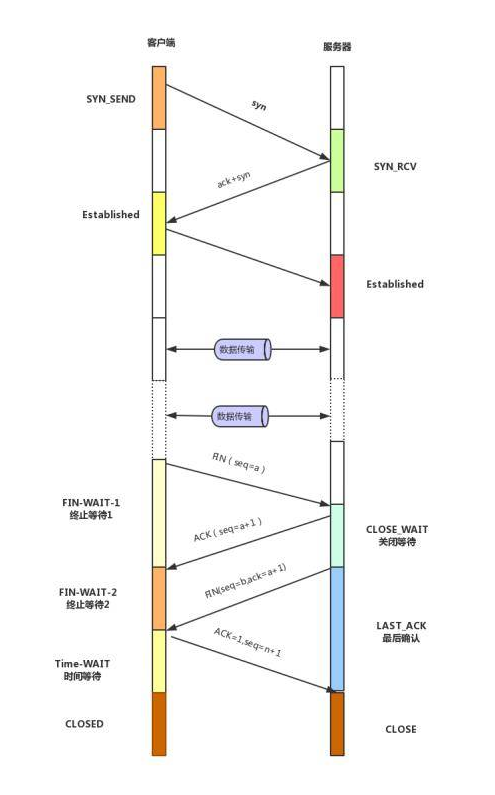

** {{ title }}：** <Excerpt in index | 首页摘要>

<!-- more -->
<The rest of contents | 余下全文>

> 持续维护java面试题系列博文，发现好的面试题会更新进来。总结的并不只是如何回答面试官，而是这道题涉及到的知识点，明白了相关知识点和面试官要问的点，回答起来就不是问题了。

## 综合

### 简述 tcp 和 udp的区别？

### IPv4 和 IPv6 区别？
我们大多数人使用的是第二代互联网 IPv4 技术，它的最大问题是网络地址资源有限，从理论上讲能编址 1600 万个网络、链接 40 亿台主机。而根据相关数据，全球 IPv4 的 IP 地址已经即将用完。
而 IPv6 是作为 IETF 设计的用于替代现行版本 IP 协议(IPv4)的下一代 IP 协议，其 IPV6 地址长度为 128位，地址空间增大了 2^98 次方倍，几乎可以说是用之不竭的。所以随着 IPv4 不足，支持 IPv6 的网络势必会增长。

### HTTP 有哪些状态码？
- 1×× : 请求处理中，请求已被接受，正在处理
- 2×× : 请求成功，请求被成功处理
  - 200 OK // 客户端请求成功
- 3×× : 重定向，要完成请求必须进行进一步处理
  - 301 Moved Permanently // 永久重定向,使用域名跳转
  - 302 Found // 临时重定向,未登陆的用户访问用户中心重定向到登录页面
- 4×× : 客户端错误，请求不合法
  - 400 Bad Request // 客户端请求有语法错误，不能被服务器所理解
  - 401 Unauthorized // 请求未经授权，这个状态代码必须和 WWW-Authenticate 报头域一起使用
  - 403 Forbidden // 服务器收到请求，但是拒绝提供服务
  - 404 Not Found // 请求资源不存在，eg：输入了错误的 URL
- 5×× : 服务器端错误，服务器不能处理合法请求
  - 500 Internal Server Error // 服务器发生不可预期的错误
  - 503 Server Unavailable // 服务器当前不能处理客户端的请求，一段时间后可能恢复正常

## TCP

### TCP的三次握手，四次挥手

三次握手：

- 第一次握手(SYN=1, seq=x)，发送完毕后，客户端进入 SYN_SEND 状态
- 第二次握手(SYN=1, ACK=1, seq=y, ACKnum=x+1)， 发送完毕后，服务器端进入 SYN_RCVD 状态。
- 第三次握手(ACK=1，ACKnum=y+1)，发送完毕后，客户端进入 ESTABLISHED 状态，当服务器端接收到这个包时，也进入 ESTABLISHED 状态，TCP 握手，即可以开始数据传输。

四次挥手：

- 第一次挥手(FIN=1，seq=a)，发送完毕后，客户端进入 FIN_WAIT_1 状态
- 第二次挥手(ACK=1，ACKnum=a+1)，发送完毕后，服务器端进入 CLOSE_WAIT 状态，客户端接收到这个确认包之后，进入 FIN_WAIT_2 状态
- 第三次挥手(FIN=1，seq=b)，发送完毕后，服务器端进入 LAST_ACK 状态，等待来自客户端的最后一个ACK。
- 第四次挥手(ACK=1，ACKnum=b+1)，客户端接收到来自服务器端的关闭请求，发送一个确认包，并进入 TIME_WAIT状态，等待了某个固定时间（两个最大段生命周期，2MSL，2 Maximum Segment Lifetime）之后，没有收到服务器端的 ACK ，认为服务器端已经正常关闭连接，于是自己也关闭连接，进入 CLOSED 状态。服务器端接收到这个确认包之后，关闭连接，进入 CLOSED 状态。

### tcp 为什么要三次握手，两次不行吗？为什么？

## UDP