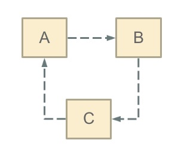

** {{ title }}：** <Excerpt in index | 首页摘要>

<!-- more -->
<The rest of contents | 余下全文>


> 持续维护java面试题系列博文，发现好的面试题会更新进来。总结的并不只是如何回答面试官，而是这道题涉及到的知识点，明白了相关知识点和面试官要问的点，回答起来就不是问题了。

## Spring

### Spring Framework

#### Spring Framework 中有多少个模块，它们分别是什么？

#### 选择使用Spring框架的原因（Spring框架为企业级开发带来的好处有哪些）？

可以从以下几个方面作答：  

- 非侵入式：支持基于POJO的编程模式，不强制性的要求实现Spring框架中的接口或继承Spring框架中的类。
- `IoC`容器：IoC容器帮助应用程序管理对象以及对象之间的依赖关系，对象之间的依赖关系如果发生了改变只需要修改配置文件而不是修改代码，因为代码的修改可能意味着项目的重新构建和完整的回归测试。有了IoC容器，程序员再也不需要自己编写工厂、单例，这一点特别符合Spring的精神"不要重复的发明轮子"。
- `AOP`（面向切面编程）：将所有的横切关注功能封装到切面（aspect）中，通过配置的方式将横切关注功能动态添加到目标代码上，进一步实现了业务逻辑和系统服务之间的分离。另一方面，有了AOP程序员可以省去很多自己写代理类的工作。
- MVC：Spring的MVC框架是非常优秀的，从各个方面都可以甩Struts 2几条街，为Web表示层提供了更好的解决方案。
- 事务管理：Spring以宽广的胸怀接纳多种持久层技术，并且为其提供了声明式的事务管理，在不需要任何一行代码的情况下就能够完成事务管理。  - 其他：选择Spring框架的原因还远不止于此，Spring为Java企业级开发提供了一站式选择，你可以在需要的时候使用它的部分和全部，更重要的是，你甚至可以在感觉不到Spring存在的情况下，在你的项目中使用Spring提供的各种优秀的功能。
- 集成主流框架：Spring 并没有闭门造车，Spring 集成了已有的技术栈，比如 ORM 框架、Logging 日期框架、J2EE、Quartz 和 JDK Timer ，以及其他视图技术。
- 模块化：Spring 框架是按照模块的形式来组织的。由包和类的命名，就可以看出其所属的模块，开发者仅仅需要选用他们需要的模块即可。
- 便捷的测试：要 测试一项用Spring开发的应用程序 十分简单，因为测试相关的环境代码都已经囊括在框架中了。更加简单的是，利用 JavaBean 形式的 POJO 类，可以很方便的利用依赖注入来写入测试数据。

#### 什么是IoC和DI？DI是如何实现的？ 

`IoC`叫控制反转，是Inversion of Control的缩写，`DI`（Dependency Injection）叫依赖注入，是对`IoC`更简单的诠释。控制反转是把传统上由程序代码直接操控的对象的调用权交给容器，通过容器来实现对象组件的装配和管理。所谓的"控制反转"就是对组件对象控制权的转移，从程序代码本身转移到了外部容器，由容器来创建对象并管理对象之间的依赖关系。`IoC`体现了好莱坞原则 - "Don’t call me, we will call you"。依赖注入的基本原则是应用组件不应该负责查找资源或者其他依赖的协作对象。配置对象的工作应该由容器负责，查找资源的逻辑应该从应用组件的代码中抽取出来，交给容器来完成。`DI`是对`IoC`更准确的描述，即组件之间的依赖关系由容器在运行期决定，形象的来说，即由容器动态的将某种依赖关系注入到组件之中。

举个例子：一个类A需要用到接口B中的方法，那么就需要为类A和接口B建立关联或依赖关系，最原始的方法是在类A中创建一个接口B的实现类C的实例，但这种方法需要开发人员自行维护二者的依赖关系，也就是说当依赖关系发生变动的时候需要修改代码并重新构建整个系统。如果通过一个容器来管理这些对象以及对象的依赖关系，则只需要在类A中定义好用于关联接口B的方法（构造器或setter方法），将类A和接口B的实现类C放入容器中，通过对容器的配置来实现二者的关联。

依赖注入可以通过setter方法注入（设值注入）、构造器注入和接口注入三种方式来实现，Spring支持setter注入和构造器注入，通常使用构造器注入来注入必须的依赖关系，对于可选的依赖关系，则setter注入是更好的选择，setter注入需要类提供无参构造器或者无参的静态工厂方法来创建对象。

#### Spring是如何解决循环依赖的？

Spring 只解决 scope 为 singleton 的循环依赖。对于scope 为 prototype 的 bean ，Spring 无法解决，直接抛出 BeanCurrentlyInCreationException 异常。

Spring解决如下循环依赖的过程：



- 首先 A 完成初始化第一步并将自己提前曝光出来（通过 ObjectFactory 将自己提前曝光），在初始化的时候，发现自己依赖对象 B，此时就会去尝试 get(B)，这个时候发现 B 还没有被创建出来
- 然后 B 就走创建流程，在 B 初始化的时候，同样发现自己依赖 C，C 也没有被创建出来
- 这个时候 C 又开始初始化进程，但是在初始化的过程中发现自己依赖 A，于是尝试 get(A)，这个时候由于 A 已经添加至缓存中（一般都是添加至三级缓存 `singletonFactories` ），通过 ObjectFactory 提前曝光，所以可以通过 `ObjectFactory#getObject()` 方法来拿到 A 对象，C 拿到 A 对象后顺利完成初始化，然后将自己添加到一级缓存中
- 回到 B ，B 也可以拿到 C 对象，完成初始化，A 可以顺利拿到 B 完成初始化。到这里整个链路就已经完成了初始化过程了

#### 请介绍下常用的 ApplicationContext 容器？

以下是三种较常见的 ApplicationContext 实现方式：

- 1、`ClassPathXmlApplicationContext` ：从 ClassPath 的 XML 配置文件中读取上下文，并生成上下文定义。应用程序上下文从程序环境变量中取得。示例代码如下：

  ```
  ApplicationContext context = new ClassPathXmlApplicationContext(“bean.xml”);
  ```

- 2、`FileSystemXmlApplicationContext` ：由文件系统中的XML配置文件读取上下文。示例代码如下：

  ```
  ApplicationContext context = new FileSystemXmlApplicationContext(“bean.xml”);
  ```

- 3、`XmlWebApplicationContext` ：由 Web 应用的XML文件读取上下文。例如我们在 Spring MVC 使用的情况。

当然，目前我们更多的是使用 Spring Boot 为主，所以使用的是第四种 ApplicationContext 容器，`ConfigServletWebServerApplicationContext` 。

#### Spring中Bean的作用域有哪些？

在Spring的早期版本中，仅有两个作用域：`singleton`和`prototype`，前者表示Bean以单例的方式存在；后者表示每次从容器中调用Bean时，都会返回一个新的实例，`prototype`通常翻译为原型。

> **补充：**设计模式中的创建型模式中也有一个原型模式，原型模式也是一个常用的模式，例如做一个室内设计软件，所有的素材都在工具箱中，而每次从工具箱中取出的都是素材对象的一个原型，可以通过对象克隆来实现原型模式。

Spring 2.x中针对`WebApplicationContext`新增了3个作用域，分别是：`request`（每次HTTP请求都会创建一个新的Bean）、`session`（同一个`HttpSession`共享同一个Bean，不同的`HttpSession`使用不同的Bean）和`globalSession`（同一个全局Session共享一个Bean）。

> **说明：**单例模式和原型模式都是重要的设计模式。一般情况下，无状态或状态不可变的类适合使用单例模式。在传统开发中，由于DAO持有`Connection`这个非线程安全对象因而没有使用单例模式；但在Spring环境下，所有DAO类对可以采用单例模式，因为Spring利用AOP和Java API中的`ThreadLocal`对非线程安全的对象进行了特殊处理。
`ThreadLocal`为解决多线程程序的并发问题提供了一种新的思路。`ThreadLocal`，顾名思义是线程的一个本地化对象，当工作于多线程中的对象使用`ThreadLocal`维护变量时，`ThreadLocal`为每个使用该变量的线程分配一个独立的变量副本，所以每一个线程都可以独立的改变自己的副本，而不影响其他线程所对应的副本。从线程的角度看，这个变量就像是线程的本地变量。

`ThreadLocal`类非常简单好用，只有四个方法，能用上的也就是下面三个方法： 

- `void set(T value)`：设置当前线程的线程局部变量的值。 
- `T get()`：获得当前线程所对应的线程局部变量的值。 
- `void remove()`：删除当前线程中线程局部变量的值。

`ThreadLocal`是如何做到为每一个线程维护一份独立的变量副本的呢？在`ThreadLocal`类中有一个Map，键为线程对象，值是其线程对应的变量的副本，自己要模拟实现一个`ThreadLocal`类其实并不困难，代码如下所示：

```java
import java.util.Collections;
import java.util.HashMap;
import java.util.Map;

public class MyThreadLocal<T> {
    private Map<Thread, T> map = Collections.synchronizedMap(new HashMap<Thread, T>());

    public void set(T newValue) {
        map.put(Thread.currentThread(), newValue);
    }

    public T get() {
        return map.get(Thread.currentThread());
    }

    public void remove() {
        map.remove(Thread.currentThread());
    }
} 
```

> 分析`ThreadLocal`源码的文章：<https://www.jianshu.com/p/98b68c97df9b>

#### Spring中自动装配的方式有哪些？ 

1. no：不进行自动装配，手动设置Bean的依赖关系。 
2. byName：根据Bean的名字进行自动装配。 
3. byType：根据Bean的类型进行自动装配。 
4. constructor：类似于byType，不过是应用于构造器的参数，如果正好有一个Bean与构造器的参数类型相同则可以自动装配，否则会导致错误。 
5. autodetect：如果有默认的构造器，则通过constructor的方式进行自动装配，否则使用byType的方式进行自动装配。

> **说明：**自动装配没有自定义装配方式那么精确，而且不能自动装配简单属性（基本类型、字符串等），在使用时应注意。

基于注解的方式：

使用@Autowired注解来自动装配指定的bean。在使用@Autowired注解之前需要在Spring配置文件进行配置，。在启动spring IoC时，容器自动装载了一个AutowiredAnnotationBeanPostProcessor后置处理器，当容器扫描到@Autowied、@Resource或@Inject时，就会在IoC容器自动查找需要的bean，并装配给该对象的属性。在使用@Autowired时，首先在容器中查询对应类型的bean：

如果查询结果刚好为一个，就将该bean装配给@Autowired指定的数据；

如果查询的结果不止一个，那么@Autowired会根据名称来查找；

如果上述查找的结果为空，那么会抛出异常。解决方法时，使用required=false。

@Autowired可用于：构造函数、成员变量、Setter方法

> 注：@Autowired和@Resource之间的区别

(1) @Autowired默认是按照类型装配注入的，默认情况下它要求依赖对象必须存在（可以设置它required属性为false）。

(2) @Resource默认是按照名称来装配注入的，只有当找不到与名称匹配的bean才会按照类型来装配注入。

#### 构造器注入的好处

- 保证依赖不可变（final关键字）
- 保证依赖不为空（省去了我们对其检查）
- 保证返回客户端（调用）的代码的时候是完全初始化的状态
- 避免了循环依赖
- 提升了代码的可复用性

当有一个依赖有多个实现的使用，推荐使用field注入或者setter注入的方式来指定注入的类型

#### Spring中如何使用注解来配置Bean？有哪些相关的注解？ 

首先需要在Spring配置文件中增加如下配置：

```xml
<context:component-scan base-package="org.example"/>
```

然后可以用`@Component`、`@Controller`、`@Service`、`@Repository`注解来标注需要由Spring IoC容器进行对象托管的类。这几个注解没有本质区别，只不过`@Controller`通常用于控制器，`@Service`通常用于业务逻辑类，`@Repository`通常用于仓储类（例如我们的DAO实现类），普通的类用`@Component`来标注。

#### 阐述Spring框架中Bean的生命周期？

1. Spring IoC容器找到关于Bean的定义并实例化该Bean。
2. Spring IoC容器对Bean进行依赖注入。
3. 如果Bean实现了`BeanNameAware`接口，则将该Bean的id传给`setBeanName`方法。
4. 如果Bean实现了`BeanFactoryAware`接口，则将`BeanFactory`对象传给`setBeanFactory`方法。
5. 如果Bean实现了`BeanPostProcessor`接口，则调用其`postProcessBeforeInitialization()`方法。
6. 如果Bean实现了`InitializingBean`接口，则调用其`afterPropertySet`方法。
7. 如果有和Bean关联的`BeanPostProcessors`对象，则这些对象的`postProcessAfterInitialization`方法被调用。
8. 当销毁Bean实例时，如果Bean实现了`DisposableBean`接口，则调用其`destroy`方法。

流程图如下：


#### BeanFactory和FactoryBean的区别？

#### 解释一下什么叫AOP（面向切面编程）？

`AOP`（Aspect-Oriented Programming）指一种程序设计范型，该范型以一种称为切面（aspect）的语言构造为基础，切面是一种新的模块化机制，用来描述分散在对象、类或方法中的横切关注点（crosscutting concern）。

#### 你是如何理解"横切关注"这个概念的？

"横切关注"是会影响到整个应用程序的关注功能，它跟正常的业务逻辑是正交的，没有必然的联系，但是几乎所有的业务逻辑都会涉及到这些关注功能。通常，事务、日志、安全性等关注就是应用中的横切关注功能。

#### 你如何理解AOP中的连接点（Joinpoint）、切点（Pointcut）、增强（Advice）、引介（Introduction）、织入（Weaving）、切面（Aspect）这些概念？

- 连接点（`Joinpoint`）：程序执行的某个特定位置（如：某个方法调用前、调用后，方法抛出异常后）。一个类或一段程序代码拥有一些具有边界性质的特定点，这些代码中的特定点就是连接点。Spring仅支持方法的连接点。 

- 切点（`Pointcut`）：如果连接点相当于数据中的记录，那么切点相当于查询条件，一个切点可以匹配多个连接点。Spring AOP的规则解析引擎负责解析切点所设定的查询条件，找到对应的连接点。 

- 增强（`Advice`）：增强是织入到目标类连接点上的一段程序代码。Spring提供的增强接口都是带方位名的，如：`BeforeAdvice`、`AfterReturningAdvice`、`ThrowsAdvice`等。很多资料上将增强译为“通知”，这明显是个词不达意的翻译，让很多程序员困惑了许久。

  > **说明：** `Advice`在国内的很多书面资料中都被翻译成"通知"，但是很显然这个翻译无法表达其本质，有少量的读物上将这个词翻译为"增强"，这个翻译是对`Advice`较为准确的诠释，我们通过`AOP`将横切关注功能加到原有的业务逻辑上，这就是对原有业务逻辑的一种增强，这种增强可以是前置增强、后置增强、返回后增强、抛异常时增强和包围型增强。

- 引介（`Introduction`）：引介是一种特殊的增强，它为类添加一些属性和方法。这样，即使一个业务类原本没有实现某个接口，通过引介功能，可以动态的未该业务类添加接口的实现逻辑，让业务类成为这个接口的实现类。 

- 织入（`Weaving`）：织入是将增强添加到目标类具体连接点上的过程，`AOP`有三种织入方式：

  - 编译期织入：需要特殊的Java编译期（例如`AspectJ`的ajc）；
  - 装载期织入：要求使用特殊的类加载器，在装载类的时候对类进行增强；
  - 运行时织入：在运行时为目标类生成代理实现增强。Spring采用了动态代理的方式实现了运行时织入，而AspectJ采用了编译期织入和装载期织入的方式。 

- 切面（`Aspect`）：切面是由切点和增强（引介）组成的，它包括了对横切关注功能的定义，也包括了对连接点的定义。

  > **补充：**代理模式是GoF提出的23种设计模式中最为经典的模式之一，代理模式是对象的结构模式，它给某一个对象提供一个代理对象，并由代理对象控制对原对象的引用。简单的说，代理对象可以完成比原对象更多的职责，当需要为原对象添加横切关注功能时，就可以使用原对象的代理对象。我们在打开Office系列的Word文档时，如果文档中有插图，当文档刚加载时，文档中的插图都只是一个虚框占位符，等用户真正翻到某页要查看该图片时，才会真正加载这张图，这其实就是对代理模式的使用，代替真正图片的虚框就是一个虚拟代理；Hibernate的load方法也是返回一个虚拟代理对象，等用户真正需要访问对象的属性时，才向数据库发出SQL语句获得真实对象。

#### Spring的AOP理解

OOP面向对象，允许开发者定义纵向的关系，但并适用于定义横向的关系，导致了大量代码的重复，而不利于各个模块的重用。

AOP，一般称为面向切面，作为面向对象的一种补充，用于将那些与业务无关，但却对多个对象产生影响的公共行为和逻辑，抽取并封装为一个可重用的模块，这个模块被命名为“切面”（Aspect），减少系统中的重复代码，降低了模块间的耦合度，同时提高了系统的可维护性。可用于权限认证、日志、事务处理。

AOP实现的关键在于 代理模式，AOP代理主要分为静态代理和动态代理。静态代理的代表为AspectJ；动态代理则以Spring AOP为代表。

（1）AspectJ是静态代理的增强，所谓静态代理，就是AOP框架会在编译阶段生成AOP代理类，因此也称为编译时增强，他会在编译阶段将AspectJ(切面)织入到Java字节码中，运行的时候就是增强之后的AOP对象。

（2）Spring AOP使用的动态代理，所谓的动态代理就是说AOP框架不会去修改字节码，而是每次运行时在内存中临时为方法生成一个AOP对象，这个AOP对象包含了目标对象的全部方法，并且在特定的切点做了增强处理，并回调原对象的方法。

Spring AOP中的动态代理主要有两种方式，JDK动态代理和CGLIB动态代理：

- JDK动态代理只提供接口的代理，不支持类的代理。核心InvocationHandler接口和Proxy类，InvocationHandler 通过invoke()方法反射来调用目标类中的代码，动态地将横切逻辑和业务编织在一起；接着，Proxy利用 InvocationHandler动态创建一个符合某一接口的的实例,  生成目标类的代理对象。
- 如果代理类没有实现 InvocationHandler 接口，那么Spring AOP会选择使用CGLIB来动态代理目标类。CGLIB（Code Generation Library），是一个代码生成的类库，可以在运行时动态的生成指定类的一个子类对象，并覆盖其中特定方法并添加增强代码，从而实现AOP。CGLIB是通过继承的方式做的动态代理，因此如果某个类被标记为final，那么它是无法使用CGLIB做动态代理的。

（3）静态代理与动态代理区别在于生成AOP代理对象的时机不同，相对来说AspectJ的静态代理方式具有更好的性能，但是AspectJ需要特定的编译器进行处理，而Spring AOP则无需特定的编译器处理。

InvocationHandler 的 invoke(Object  proxy,Method  method,Object[] args)：proxy是最终生成的代理实例;  method 是被代理目标实例的某个具体方法;  args 是被代理目标实例某个方法的具体入参, 在方法反射调用时使用。

#### Spring事务的实现方式和实现原理

Spring事务的本质其实就是数据库对事务的支持，没有数据库的事务支持，spring是无法提供事务功能的。真正的数据库层的事务提交和回滚是通过binlog或者redo log实现的。

- Spring事务的种类：spring支持编程式事务管理和声明式事务管理两种方式
  - 编程式事务管理使用TransactionTemplate。
  - 声明式事务管理建立在AOP之上的。其本质是通过AOP功能，对方法前后进行拦截，将事务处理的功能编织到拦截的方法中，也就是在目标方法开始之前加入一个事务，在执行完目标方法之后根据执行情况提交或者回滚事务。声明式事务最大的优点就是不需要在业务逻辑代码中掺杂事务管理的代码，只需在配置文件中做相关的事务规则声明或通过@Transactional注解的方式，便可以将事务规则应用到业务逻辑中。声明式事务管理要优于编程式事务管理，这正是spring倡导的非侵入式的开发方式，使业务代码不受污染，只要加上注解就可以获得完全的事务支持。唯一不足地方是，最细粒度只能作用到方法级别，无法做到像编程式事务那样可以作用到代码块级别。
- spring的事务传播行为：spring事务的传播行为说的是，当多个事务同时存在的时候，spring如何处理这些事务的行为。
  - `PROPAGATION_REQUIRED`：如果当前没有事务，就创建一个新事务，如果当前存在事务，就加入该事务，该设置是最常用的设置。
  - `PROPAGATION_SUPPORTS`：支持当前事务，如果当前存在事务，就加入该事务，如果当前不存在事务，就以非事务执行。
  - `PROPAGATION_MANDATORY`：支持当前事务，如果当前存在事务，就加入该事务，如果当前不存在事务，就抛出异常。
  - `PROPAGATION_REQUIRES_NEW`：创建新事务，无论当前存不存在事务，都创建新事务。
  - `PROPAGATION_NOT_SUPPORTED`：以非事务方式执行操作，如果当前存在事务，就把当前事务挂起。
  - `PROPAGATION_NEVER`：以非事务方式执行，如果当前存在事务，则抛出异常。
  - `PROPAGATION_NESTED`：如果当前存在事务，则在嵌套事务内执行。如果当前没有事务，则按REQUIRED属性执行。

- Spring中的隔离级别：
  - `ISOLATION_DEFAULT`：这是个 PlatfromTransactionManager 默认的隔离级别，使用数据库默认的事务隔离级别。
  - `ISOLATION_READ_UNCOMMITTED`：读未提交，允许另外一个事务可以看到这个事务未提交的数据。
  - `ISOLATION_READ_COMMITTED`：读已提交，保证一个事务修改的数据提交后才能被另一事务读取，而且能看到该事务对已有记录的更新。
  - `ISOLATION_REPEATABLE_READ`：可重复读，保证一个事务修改的数据提交后才能被另一事务读取，但是不能看到该事务对已有记录的更新。
  - `ISOLATION_SERIALIZABLE`：一个事务在执行的过程中完全看不到其他事务对数据库所做的更新。

#### Spring 框架中有哪些不同类型的事件？

- `ApplicationStartingEvent`：一旦启动SpringApplication，便会尽快发布事件，但是在`Environment`或`ApplicationContext`可用之前，在`ApplicationListeners`已注册之后。
- `ApplicationEnvironmentPreparedEvent`：在启动SpringApplication且首次可用于检查和修改环境时发布的事件。
- `ApplicationPreparedEvent`：当SpringApplication启动且`ApplicationContext`已完全准备但未刷新时发布的事件。
- `ApplicationStartedEvent`：一旦刷新了应用程序上下文，但在调用任何应用程序和命令行运行程序之前，都会发布事件。
- `ApplicationReadyEvent`：可能在很晚才发布的事件，指示该应用程序已准备就绪，可以处理请求。
- `ApplicationFailedEvent`：SpringApplication启动失败时发布的事件。

### SpringMVC

#### Spring MVC的工作原理是怎样的？ 

1. 客户端的所有请求都交给前端控制器`DispatcherServlet`来处理，它会负责调用系统的其他模块来真正处理用户的请求。
2. `DispatcherServlet`收到请求后，将根据请求的信息（包括URL、HTTP协议方法、请求头、请求参数、Cookie等）以及`HandlerMapping`的配置找到处理该请求的`Handler`（任何一个对象都可以作为请求的Handler）。  
3. 在这个地方Spring会通过`HandlerAdapter`对该处理器进行封装。
4. `HandlerAdapter`是一个适配器，它用统一的接口对各种`Handler`中的方法进行调用。
5. Handler完成对用户请求的处理后，会返回一个`ModelAndView`对象给`DispatcherServlet`，`ModelAndView`顾名思义，包含了数据模型以及相应的视图的信息。`
6. `ModelAndView`的视图是逻辑视图，`DispatcherServlet`还要借助`ViewResolver`完成从逻辑视图到真实视图对象的解析工作。`
7. 当得到真正的视图对象后，`DispatcherServlet`会利用视图对象对模型数据进行渲染。
8. 客户端得到响应，可能是一个普通的HTML页面，也可以是XML或JSON字符串，还可以是一张图片或者一个PDF文件。

## Spring Boot

### core

#### spring boot 核心配置文件是什么？

spring boot 核心的两个配置文件：

1. bootstrap (.yml 或者 .properties)：boostrap 由父 ApplicationContext 加载的，比 applicaton 优先加载，且 boostrap 里面的属性不能被覆盖；
2. application (.yml 或者 .properties)：用于 spring boot 项目的自动化配置。

### spring-boot-data-jpa

#### Difference between save and saveAndFlush in Spring data jpa

On `saveAndFlush`, changes will be flushed to DB immediately in this command. With `save`, this is not necessarily true, and might stay just in memory, until `flush` or `commit` commands are issued.

But be aware, that even if you flush the changes in transaction and do not commit them, the changes still won't be visible to the outside transactions until the commit in this transaction.

In your case, you probably use some sort of transactions mechanism, which issues `commit`command for you if everything works out fine.

## Spring Cloud


>参考链接：
>
>https://blog.csdn.net/jackfrued/article/details/44921941

