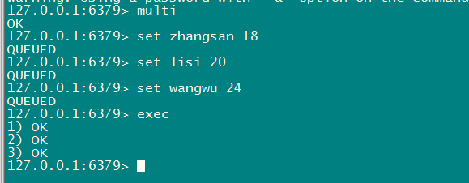
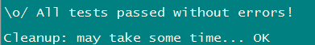
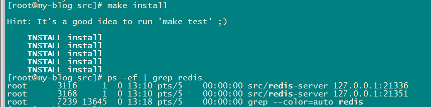
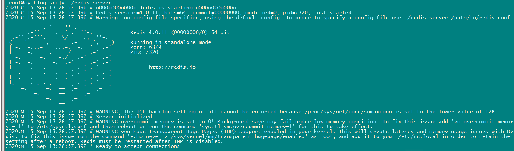
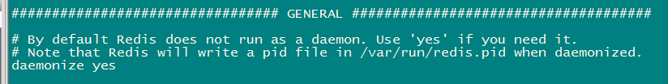

** {{ title }}：** <Excerpt in index | 首页摘要>

<!-- more -->
<The rest of contents | 余下全文>


> 资源列表:
>
> [Redis 命令参考](http://doc.redisfans.com/)
>
> [Commands](https://redis.io/commands)

## Redis是什么

　　`Redis`是一个开源(`BSD许可`)的内存中的数据结构存储，用作数据库、缓存和消息中间件。它支持多种数据结构，如`字符串`、`哈希表`、`列表`、`无序集合`、`有序集合`的范围查询，`位图`、`基数统计`和`地理空间索引`的与查询。Redis内置`复制`、`Lua脚本`、`LRU回收`、`事务`和不同级别的`磁盘持久化`，并通过`哨兵`和`自动分区`提供高可用性集群。


## 单线程结构

- 纯内存数据库，瓶颈不在内存，在于网络IO
- 单线程，避免频繁切换上下文
- 异步阻塞I/O（多路复用）

## 持久化

### RDB（Redis DataBase）持久化

- 快照
- 优点：适合备份、还原、恢复数据快、最大化 Redis 的性能
- 缺点：两次快照间的数据会丢失、数据集比较庞大时， `fork()` 可能会非常耗时

### AOF（Append Only File）持久化

- 日志
- 优点：数据完整性高、可读性高、可重写（重写后的新 AOF 文件包含了恢复当前数据集所需的最小命令集合）
- 缺点：体积大、慢于RDB、有bug

## 事务

`multi`开启事务，`exec`执行事务



　　可以看到，redis事务实现原理是将要执行的命令，存储到一个队列中，依次执行，报错时停止并取消事务，不报错则提交事务。

> 例外：不会回滚的情况：
>
> 当一个事务中某一条（多条）命令加入队列不报错，执行时才会报错，则redis会忽略错误继续执行。

　　使用`watch`监视一个(或多个) key ，如果在事务执行之前这个(或这些) key 被其他命令所改动，那么事务将被打断。当`exec`被调用时， 不管事务是否成功执行， 对所有键的监视都会被取消。或者调用`unwatch`手动取消监控。

## 管道

- pipeline通过减少客户端与redis的通信次数来实现降低往返延时时间，而且Pipeline 实现的原理是队列，而队列的原理是时先进先出，这样就保证数据的顺序性。

- 适用场景：批量操作、可靠性要求不高、

## Lua脚本

　　Lua是一个高效的轻量级脚本语言，用标准C语言编写并以源代码形式开放， 其设计目的是为了嵌入应用程序中，从而为应用程序提供灵活的扩展和定制功能，从定义上来说， Redis 中的脚本本身就是一种事务， 所以任何在事务里可以完成的事， 在脚本里面也能完成。 并且一般来说， 使用脚本要来得更简单，并且速度更快。

- 通过lua脚本可以原子执行多条redis命令
- 执行lua脚本期间，会阻塞所有命令操作

### 使用脚本的好处

- 减少网络开销，在Lua脚本中可以把多个命令放在同一个脚本中运行
- 原子操作，redis会将整个脚本作为一个整体执行，中间不会被其他命令插入。换句话说，编写脚本的过程中无需担心会出现竞态条件
- 复用性，客户端发送的脚本会永远存储在redis中，这意味着其他客户端可以复用这一脚本来完成同样的逻辑

## 多数据库支持

默认支持16个数据库；可以理解为一个命名空间

跟关系型数据库不一样的点

1. redis不支持自定义数据库名词

2. 每个数据库不能单独设置授权

3. 每个数据库之间并不是完全隔离的。 可以通过flushall命令清空redis实例面的所有数据库中的数据

> 通过  select dbid 去选择不同的数据库命名空间 。 dbid的取值范围默认是0 -15


## 分布式集群

　　Redis Cluster中，Sharding采用slot(槽)的概念，一共分成16384个槽，这有点儿类似前面讲的pre sharding思路。对于每个进入Redis的键值对，根据key进行散列，分配到这16384个slot中的某一个中。使用的hash算法也比较简单，就是CRC16后16384取模。Redis集群中的每个node(节点)负责分摊这16384个slot中的一部分，也就是说，每个slot都对应一个node负责处理。当动态添加或减少node节点时，需要将16384个槽做个再分配，槽中的键值也要迁移。当然，这一过程，在目前实现中，还处于半自动状态，需要人工介入。Redis集群，要保证16384个槽对应的node都正常工作，如果某个node发生故障，那它负责的slots也就失效，整个集群将不能工作。为了增加集群的可访问性，官方推荐的方案是将node配置成主从结构，即一个master主节点，挂n个slave从节点。这时，如果主节点失效，Redis Cluster会根据选举算法从slave节点中选择一个上升为主节点，整个集群继续对外提供服务。这非常类似服务器节点通过Sentinel监控架构成主从结构，只是Redis Cluster本身提供了故障转移容错的能力。

- redis sharding
- codis
- twemproxy

## 支持的数据类型、常用命令、常用场景

### String

> 默认存储最大容量为512M
>
> 常用命令：[set](http://doc.redisfans.com/string/set.html)、[get](http://doc.redisfans.com/string/get.html)、[incr](http://doc.redisfans.com/string/incr.html)、[decr](http://doc.redisfans.com/string/decr.html)、[append](http://doc.redisfans.com/string/append.html)、[strlen](http://doc.redisfans.com/string/strlen.html)、[mget](http://doc.redisfans.com/string/mget.html)、[setnx](http://doc.redisfans.com/string/setnx.html)

- set+get：缓存、单点登录

- bitmap：用户上线次数统计
- incr：计数器、限速器

### List

> 有序，可重复
>
> 常用命令：[lpush](http://doc.redisfans.com/list/push.html)、[rpush](http://doc.redisfans.com/list/rpush.html)、[lpop](http://doc.redisfans.com/list/lpop.html)、[rpop](http://doc.redisfans.com/list/rpop.html)、[llen](http://doc.redisfans.com/list/llen.html)、[lrange](http://doc.redisfans.com/list/lrange.html)、[lrem](http://doc.redisfans.com/list/lrem.html)、[lset](http://doc.redisfans.com/list/lset.html)

- lpush+lpop：Stack(栈)  
- lpush+rpop：Queue（队列）  
- lpush+ltrim：Capped Collection（有限集合）  
- lpush+brpop：Message Queue（消息队列）
- blpop：事件提醒（替代轮询）

### Hash

> 不支持数据类型的嵌套
>
> 适合存储对象
>
> 常用命令：[hset](http://doc.redisfans.com/hash/hset.html)、[hget](http://doc.redisfans.com/hash/hget.html)、[hmset](http://doc.redisfans.com/hash/hmset
> ,.html)、[hmget](http://doc.redisfans.com/hash/hmget.html)、[hgetall](http://doc.redisfans.com/hash/hgetall.html)、[hexists](http://doc.redisfans.com/hash/hexists.html)、[hincrby](http://doc.redisfans.com/hash/hincryby.html)、[hsetnx](http://doc.redisfans.com/hash/hsetnx.html)、[hdel](http://doc.redisfans.com/hash/hdel.html)

### Set

> 无序、不重复
>
> 常用命令：[sadd](http://doc.redisfans.com/set/sadd.html)、[srem](http://doc.redisfans.com/set/srem.html)、[smembers](http://doc.redisfans.com/set/smembers.html)、[sdiff](http://doc.redisfans.com/set/sdiff.html)、[sunion](http://doc.redisfans.com/set/sunion.html)、[sinter](http://doc.redisfans.com/set/sinter.html)

- sadd：标签
- sinter：交集
- sunion：并集

### SortedSet

> 有序、不重复
>
> 常用命令：[zadd](http://doc.redisfans.com/sorted_set/zadd.html)、[zrange](http://doc.redisfans.com/sorted_set/zrange.html)

- zcount：统计信息
- zrevrange：排行榜

### key

>  常用命令：[expire](http://doc.redisfans.com/key/expire.html)、[ttl](http://doc.redisfans.com/key/ttl.html)

### Script

>  常用命令：[eval](http://redisdoc.com/script/eval.html)

## Redis安装

### 安装

首先，到redis官网找到要安装的redis版本，[Redis下载页](https://redis.io/download)，我们这里选用`v4.0.11`，依次执行下面命令：

```shell
# wget http://download.redis.io/releases/redis-4.0.11.tar.gz
# tar xzf redis-4.0.11.tar.gz
# cd redis-4.0.11
# make
```

到此安装完成，然后可以通过`make test`测试编译状态

```shell
# make test
```

无报错完成编译应该会有这样的输出：



> 报错：需要tcl 8.5以上来运行redis test
>
> You need tcl 8.5 or newer in order to run the Redis test
> make: *** [test] Error 1

下面安装`tcl8.6.1`：

```shell
# wget http://downloads.sourceforge.net/tcl/tcl8.6.1-src.tar.gz
# sudo tar xzvf tcl8.6.1-src.tar.gz
# cd tcl8.6.1/unix/
# sudo ./configure
# sudo make
# sudo make install 
```

再次运行`make test`，没问题之后，运行最后一步，完成安装：

```shell
# make install
```



直接启动：

```shell
# ./redis-server ../redis.conf
```



后台启动redis，只需修改`redis.conf`配置文件的`daemonize yes`，再次启动即可。



### 安装启动相关命令

#### 启动redis服务器：

```shell
# ./redis-server ../redis.conf
```

#### 停止redis服务:

```shell
# ./redis-cli shutdown
```

#### 连接本地启动好的redis：

```shell
# redis-cli
```

#### 根据ip端口连接redis：

```shell
# redis-cli -h 127.0.0.1 -p 6379
```

#### 查看当前是否设置了密码

```shell
127.0.0.1:6379> config get requirepass
1) "requirepass"
2) ""
```

#### 设置密码

```shell
127.0.0.1:6379> config set requirepass 123456 //密码是123456
OK
```


## 使用总结

### 关于key

- 建议key不要太长，不要超过1024字节，占用内存且会降低查询效率
- 建议统一命名规则，例如：String:001:zhangsan:age

### 使用 bitmap 实现用户上线次数统计

　　Bitmap 对于一些特定类型的计算非常有效。

　　假设现在我们希望记录自己网站上的用户的上线频率，比如说，计算用户 A 上线了多少天，用户 B 上线了多少天，诸如此类，以此作为数据，从而决定让哪些用户参加 beta 测试等活动 —— 这个模式可以使用 [*SETBIT*](http://doc.redisfans.com/string/setbit.html#setbit) 和 [*BITCOUNT*](http://doc.redisfans.com/string/bitcount.html#bitcount) 来实现。

　　比如说，每当用户在某一天上线的时候，我们就使用 [*SETBIT*](http://doc.redisfans.com/string/setbit.html#setbit) ，以用户名作为 `key` ，将那天所代表的网站的上线日作为 `offset` 参数，并将这个 `offset` 上的为设置为 `1` 。

　　举个例子，如果今天是网站上线的第 100 天，而用户 peter 在今天阅览过网站，那么执行命令 `SETBIT peter 100 1` ；如果明天 peter 也继续阅览网站，那么执行命令 `SETBIT peter 101 1` ，以此类推。

　　当要计算 peter 总共以来的上线次数时，就使用 [*BITCOUNT*](http://doc.redisfans.com/string/bitcount.html#bitcount) 命令：执行 `BITCOUNT peter` ，得出的结果就是 peter 上线的总天数。

　　更详细的实现可以参考博文(墙外) [Fast, easy, realtime metrics using Redis bitmaps](http://blog.getspool.com/2011/11/29/fast-easy-realtime-metrics-using-redis-bitmaps/) 。

### 缓存

#### 缓存预热

发现热点数据

- 写代码（不推荐）
- 代理层抓包

- 通过facebook开源组件redis-faina，监听redis中key值变化，记录热点数据
- packetbeat插件

#### 缓存一致性

顾名思义，指数据库和缓存的数据一致性。

解决方案：

- 先更新库数据，再删除缓存

- 先删除缓存，再更新数据

  - > 当热点数据读缓存并发较高时，可以采用延时双删：先删除缓存，再更新数据库，再删除缓存

#### 缓存击穿

缓存击穿是指key过期瞬间并发访问数据库读取新值，导致大量请求到DB。

解决方案：

- 设置热点数据永不过期
- 加互斥锁

#### 缓存穿透

缓存穿透是指查询一个根本不存在的数据，将导致不存在的数据每次请求都要到存储层去查询，失去了缓存保护后端存储的意义。

解决方案：

- 缓存空对象
  - 缺点：
    - 需要更多的缓存空间
    - 缓存层和存储层的数据会有一段时间窗口的不一致，可能会对业务有一定影响。例如过期时间设置为 5 分钟，如果此时存储层添加了这个数据，那此段时间就会出现缓存层和存储层数据的不一致，此时可以利用消息系统或者其他方式清除掉缓存层中的空对象。
- 布隆过滤器
  - 缺点：
    - 存在误判

#### 缓存雪崩

如果缓存层由于某些原因整体不能提供服务，于是所有的请求都会达到存储层，存储层的调用量会暴增，造成存储层也会挂掉的情况。或者大量key同时过期，请求直接打到DB。

解决方案：

- 保证缓存层服务高可用性。
- 本地缓存
- 依赖隔离组件为后端限流并降级。
- 避免缓存的Key同时过期
- 请求DB限流
- 预更新即将过期的key

### 分布式锁的实现

`setnx`+`lua`实现

```java
public class RedisTool {

    private static final String LOCK_SUCCESS = "OK";
    private static final String SET_IF_NOT_EXIST = "NX";
    private static final String SET_WITH_EXPIRE_TIME = "PX";
    private static final Long RELEASE_SUCCESS = 1L;

    // 获取锁
    public static boolean getLock(Jedis jedis, String lockKey, String requestId, int expireTime) {

        String result = jedis.set(lockKey, requestId, SET_IF_NOT_EXIST, SET_WITH_EXPIRE_TIME, expireTime);

        if (LOCK_SUCCESS.equals(result)) {
            return true;
        }
        return false;

    }

	// 释放锁
    public static boolean releaseLock(Jedis jedis, String lockKey, String requestId) {

        String script = "if redis.call('get', KEYS[1]) == ARGV[1] then return redis.call('del', KEYS[1]) else return 0 end";
        Object result = jedis.eval(script, Collections.singletonList(lockKey), Collections.singletonList(requestId));

        if (RELEASE_SUCCESS.equals(result)) {
            return true;
        }
        return false;
    }
}
```

### 抢红包，秒杀的实现

`incr`+`lua`脚本实现


> 参考链接：
>
> http://doc.redisfans.com
>
> https://blog.csdn.net/liqingtx/article/details/60330555