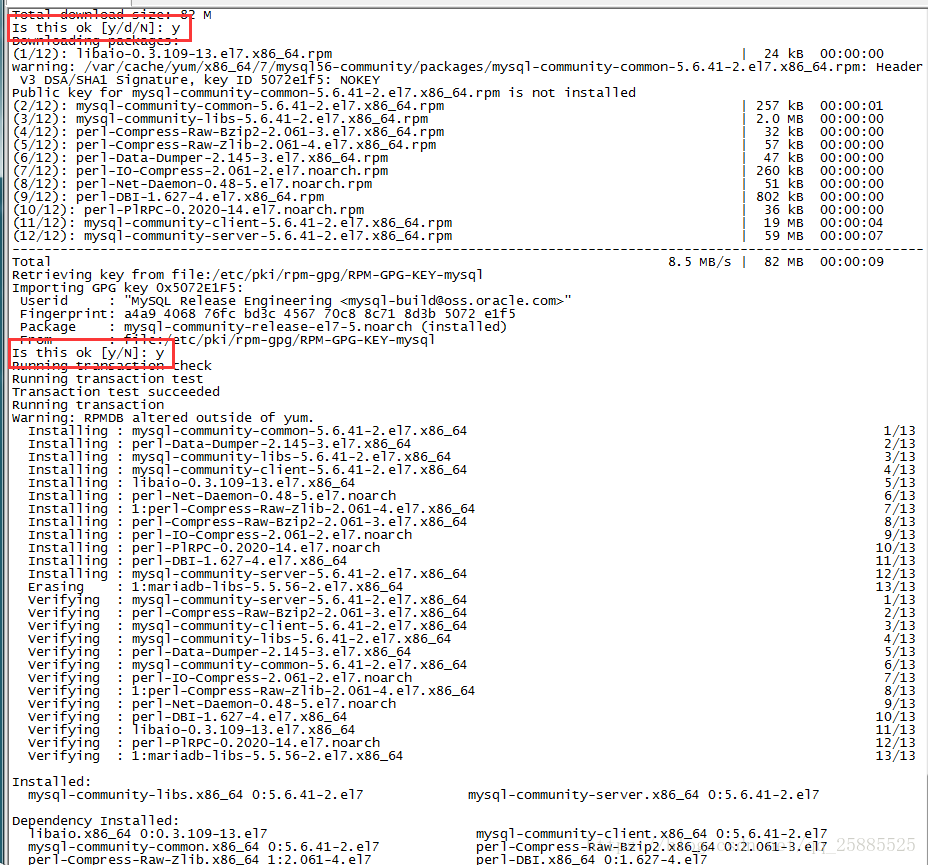
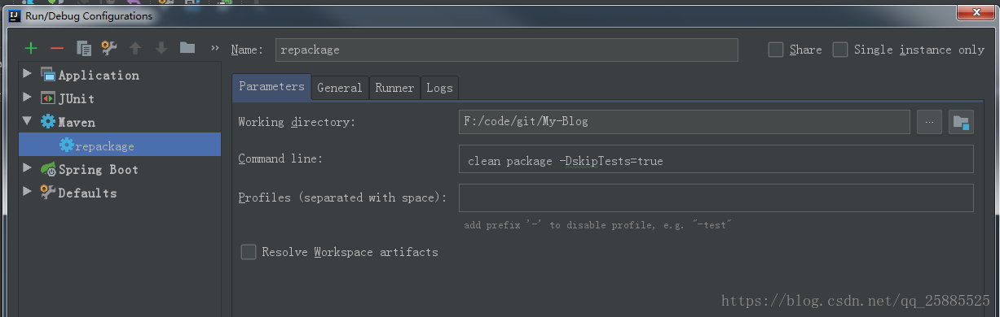
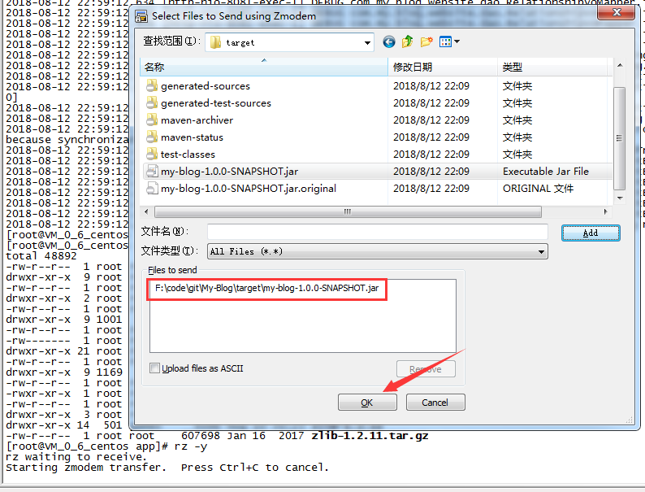

** {{ title }}：** <Excerpt in index | 首页摘要>


<!-- more -->
<The rest of contents | 余下全文>

## 环境说明

> Linux机器环境：`CentOS 7.4 64位` + `JDK8` + `MySql5.6.41` + `Nginx-1.1.10`

> 框架：`Spring Boot v2.0.4.RELEASE`,` Spring v5.0.8.RELEASE`

## 安装JDK

```
yum install java-1.8.0-openjdk* -y
```
执行这条命令后若无报错，则jdk就下载并安装完成，到这里一般没什么问题。

## 安装Mysql

这里选择的是mysql5.6.41，可以在[这里](https://dev.mysql.com/downloads/repo/yum/)自己选择对应版本mysql，另外我这里把软件都安装在/usr/app目录下，方便管理。
```
wget http://dev.mysql.com/get/mysql-community-release-el7-5.noarch.rpm
rpm -ivh mysql-community-release-el7-5.noarch.rpm
yum install mysql-community-server
```
安装过程中会让你确认两次，输入‘y’就好，如下图


重启Mysql服务

```
service mysqld restart
```
### 进入Mysql
```
mysql -u root
```
### 修改Mysql密码
这里修改为root
```
set password for 'root'@'localhost' =password('root');
```
到这里Mysql就安装完成了，但是不能远程连接数据库的，下面设置mysql数据库远程连接权限
### 设置mysql数据库远程连接权限
```
grant all privileges on *.* to root@'%'identified by 'root';
```

## 安装Nginx

### 安装C++环境

```
yum -y install gcc automake autoconf libtool make
yum install gcc gcc-c++
```
### 安装Nginx依赖pcre库
```
wget ftp://ftp.csx.cam.ac.uk/pub/software/programming/pcre/pcre-8.39.tar.gz 
tar -zxvf pcre-8.39.tar.gz 
cd pcre-8.39
./configure
make & make install
```
### 安装Nginx依赖zlib库

```
wget http://zlib.net/zlib-1.2.11.tar.gz
tar -zxvf zlib-1.2.11.tar.gz
cd zlib-1.2.11
./configure
make & make install
```
### 安装openssl
```
cd ..
wget https://www.openssl.org/source/openssl-1.0.1t.tar.gz
tar -zxvf openssl-1.0.1t.tar.gz
```
### 安装nginx
```
wget http://nginx.org/download/nginx-1.1.10.tar.gz
tar -zxvf nginx-1.1.10.tar.gz
cd nginx-1.1.10
./configure
make & make install
```
### 配置nginx
在/usr/local/nginx/conf/nginx.conf文件中增加应用的反向代理配置，server_name 配置你要代理的域名，proxy_pass 配置本地应用访问地址
```
    server {
        listen        80;
        server_name   www.yzxz.site;
        index index.jsp index.html index.html index.shtml;
        location / {
                proxy_pass http://localhost:8081;
                proxy_set_header Host $host;
                proxy_set_header X-Real-IP $remote_addr;
                proxy_set_header X-Forwarded-For $proxy_add_x_forwarded_for;
                }
        }
```
> nginx 相关命令:

启动nginx
```
/usr/local/nginx/sbin/nginx -c /usr/local/nginx/conf/nginx.conf
```
查找nginx PID
```
ps -ef|grep nginx
```
nginx服务完当前任务停止服务
```
kill -QUIT 23205
```
## 打包发布
首先，将本地代码打包成jar，然后将jar上传至服务器，最后用脚本启动
### IDEA打包配置


### 上传打包完成的jar
```
rz -y
```

若报错`-bash: rz: command not found`，则需要安装rz命令，安装好之后则可正常使用rz系列命令了

```
yum -y install lrzsz
```
在弹出窗口中选择打包好的jar包应用

### 重启应用脚本
```sh
#!/bin/sh
RESOURCE_NAME=my-blog-*.jar
 
tpid=`ps -ef|grep $RESOURCE_NAME|grep -v grep|grep -v kill|awk '{print $2}'`
if [ ${tpid} ]; then
echo 'Stop Process...'
kill -15 $tpid
fi
sleep 5
tpid=`ps -ef|grep $RESOURCE_NAME|grep -v grep|grep -v kill|awk '{print $2}'`
if [ ${tpid} ]; then
echo 'Kill Process!'
kill -9 $tpid
else
echo 'Stop Success!'
fi
 
tpid=`ps -ef|grep $RESOURCE_NAME|grep -v grep|grep -v kill|awk '{print $2}'`
if [ ${tpid} ]; then
    echo 'App is running.'
else
    echo 'App is NOT running.'
fi
 
rm -f tpid
nohup java -jar ./$RESOURCE_NAME >/dev/null 2>&1 &
echo $! > tpid
echo Start Success!
```
运行脚本的时候运行的时候如果报错，应该是文件格式转换的问题

`bash: ./a.sh: /bin/bash^M: bad interpreter: No such file or directory`
```
yum -y install dos2unix
dos2unix start.sh
```
## 重启服务
> 注意：第一次运行的时候获取一下超级管理员权限
```
chmod +x start.sh
```
```
./start.sh
```

