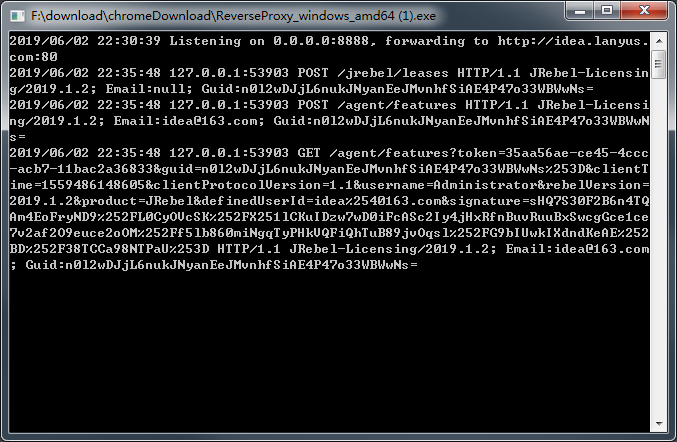

** {{ title }}：** <Excerpt in index | 首页摘要>

<!-- more -->
<The rest of contents | 余下全文>


> 资源列表
>
> 1. 官方网站：<http://www.jetbrains.com/idea/>
> 2. 官网教学视频：<http://www.jetbrains.com/idea/documentation/>

## 简介

IDEA 全称 IntelliJ IDEA，是java编程语言开发的集成环境。IntelliJ在业界被公认为最好的java开发工具之一，尤其在智能代码助手、代码自动提示、重构、J2EE支持、各类版本工具(git、svn等)、JUnit、CVS整合、代码分析、 创新的GUI设计等方面的功能可以说是超常的。IDEA是JetBrains公司的产品，这家公司总部位于捷克共和国的首都布拉格，开发人员以严谨著称的东欧程序员为主。它的旗舰版本还支持HTML，CSS，PHP，MySQL，Python等。免费版只支持Python等少数语言。

## 安装与破解

下载地址：<http://www.jetbrains.com/idea/download>


idea官方提供了windows、macOS、linux三种系统可供选择，每种操作系统都提供了Ultimate，Community两种版本，前者为收费版，包含全部功能，后者为社区版，包含部分功能。下载安装过程与大多数软件大同小异，此处不再赘述。值得一提的是，收费版需要购买注册码，要$499每年，属实不便宜，故此处记录下网友们的破解方法，如果有能力还是提倡支持正版。

### 破解

方法一：

第一步，下载`JetbrainsIdesCrack-4.2-release`，百度云下载地址：https://pan.baidu.com/s/1PrTR_CQSMa82UiyDXxLk1Q 提取码: 65up

第二步，将下载的jar扔到IDEA的bin目录下，如图

第三步，如果电脑是64位的就编辑`idea64.exe.vmoptions`文件，32位编辑`idea.exe.vmoptions`这个文件，在最后面添加：`-javaagent:G:\IntelliJ IDEA 2019.1\bin\JetbrainsIdesCrack-4.2-release.jar`，bin前面替换成idea的安装目录，后面替换成下载到的jar名称。

第四步，启动idea填写注册码。将相同内容填写进去即可。

方法二：

通过lanyu`s大神提供的在线生成注册码的工具生成注册码，地址是：http://idea.lanyus.com/ ， 点击下方“获取注册码”，即可获取注册码。启动idea填写注册码即可。

> 方法一有效期较长，但有些麻烦，方法二有效期短，但简单方便，请各自斟酌选择。

## 插件推荐

### Lombok

Lombok是一款通过注解在Java编译期生成代码的工具，需要安装idea插件及添加lombok的maven依赖。如下

```pom
        <dependency>
            <groupId>org.projectlombok</groupId>
            <artifactId>lombok</artifactId>
            <optional>true</optional>
        </dependency>
```

#### 常用注解

- `@AllArgsConstructor`：生成全参构造函数
- `@NoArgsConstructor`：生成无参构造函数
- `@RequiredArgsConstructor`：生成参数是final字段和带有@NonNull等约束的字段的构造函数
- `@Builder`：bulider模式构造对象
- `@Data`：是`@Getter` `@Setter` `@RequiredArgsConstructor` `@ToString` `@EqualsAndHashCode`的组合注解
- `@EqualsAndHashCode`：自动重写equals和hashCode方法
- `@Getter`：生成属性getter方法
- `@Setter`：生成属性setter方法
- `@ToString`：自动重写toString方法
- `@Slf4j`、`@Log4j`、`@Log4j2`：提供日志支持

### Translation

支持三种谷歌翻译、有道翻译和百度翻译三种，个人推荐谷歌翻译但需要科学上网或者配置代理


idea配置http代理


若是无法科学上网或者没有代理可以配置，则推荐有道翻译，但是需要到有道开放平台申请应用ID及应用密钥，点击红色框下面的蓝色字或者[这里](http://ai.youdao.com/)申请。


可以使用快捷键：`Ctrl+Shift+Y`呼出如下翻译界面，如下图一。可以使用快捷键：`Ctrl+Shift+O`呼出如下翻译界面，如下图二。当然也支持段落翻译，如下图三。

### JRebel for IntelliJ

#### 破解教程

下载lanyu's大神做的[反代工具](http://blog.lanyus.com/archives/317.html)，下载地址：<https://github.com/ilanyu/ReverseProxy/releases>，我是windows系统，所以下载了[ReverseProxy_windows_amd64.exe](https://github.com/ilanyu/ReverseProxy/releases/download/v1.4/ReverseProxy_windows_amd64.exe)这个版本，下载之后直接双击执行，然后允许通过防火墙，然后开始激活JRebel，选择Team URL，填写http://127.0.0.1:8888/UUID 和有效邮箱格式，如下图一，下面I agree点一下，等几秒钟，就ok了，如下图二，此时exe窗口出现了变化如下图三，激活成功界面如下图四



点击Work offline就可以开启离线模式了。此时启动项目就会有相关日志打印出来，如下图五


### GsonFormat

一个json格式化插件，简单实用，`Alt+Insert`呼出Generate界面，选择GsonFormat则可格式化json数据


### GenerateAllSetter

在`User user`的user上使用快捷键`Alt+Enter`可以呼出如下界面图一，可以选择第一个生成User所有属性值为空的setter方法，选择第二个可以生成所有属性值为默认值的setter方法。生成之后如下图二


### Maven Helper

打开pom文件，下面切换tab到`Dependency Analyzer`可以查看冲突的依赖，所有依赖列表和所有依赖树等，还可以重新导入，不过这个跟右侧的maven管理功能重叠了，不常用，常用的是用来分析maven依赖关系及冲突的jar包，方便管理maven依赖。


### PlantUML

> 参考文档：http://plantuml.com/zh/index

简单举个栗子，包含了一些常用的


### Alibaba Cloud Toolkit

Alibaba Cloud Toolkit （后文简称 Cloud Toolkit）是针对 IDE 平台为开发者提供的一款插件，用于帮助开发者更高效地开发、测试、诊断应用和部署应用。您可以使用 Cloud Toolkit 将应用部署到云端（ECS、EDAS、容器服务 Kubernetes 版等云产品）和任意服务器中去；通过内嵌的 Arthas 程序诊断、 Terminal Shell 终端和 MySQL 执行器等工具，可以快速开发、测试和诊断应用。

> 参考文档：https://help.aliyun.com/product/29966.html?spm=a2c4g.11186623.6.540.63e11dcfMfMbjM

## 常用设置

### 主题设置


### 更新提示关闭设置


### 快捷键设置

idea为从eclipse转过来的用户专门设置了一套与idea基本一致的快捷键集，大大降低了转开发工具的难度，而且支持部分快捷键更改，很灵活。


### 自动导包设置

因人而异，有些人喜欢自动导包可控性强且可以熟悉代码都用了那些依赖包，有人怕麻烦喜欢自动导包，看喜好吧。


### 代码折叠设置


### 字体设置


### 配色方案设置

三种界面及代码配色方案，君可按个人喜好选择。


`Default`方案，整个界面为白色底色，与eclipse配色相近，刚从eclipse转到idea的小伙伴会更适应。


`Darcula`配色方案，整体底色为黑色，高端大气，个人比较喜欢这个配色。


`High Contrast`配色方案，整体配色与`Darcula`相近，不同的是这款配色方案代码加了高亮显示，让人更沉浸在coding中。


当然也可以三种方案自由搭配，如图整体配色方案为`Darcula`时也可以单独设置java代码块配色方案为`Default`，并可在下方预览设置效果。


### 代码风格设置

下面是java代码中Tab和缩进设置，我们使用Tab键为4个空格缩进，该设置团队应统一。


Java代码块中空格位置设置，建议采用默认设置，如需修改某一项，可在右侧预览。


### 文件编码格式设置

文件编码格式设置，可为每个model设置不同的编码格式


### 插件安装


当然如果网络被墙或者被限制时，也可以选择设置代理或者从硬盘选择文件进行安装，这时就比较灵活了。


### 版本控制设置

关联github账户，这样做的好处是很多文件的操作会自动进行版本管控，而且往github推拉文件都比较方便。


例如，当使用idea从git克隆仓库时，会自动检测登录账号下的仓库，方便快捷，当然`Git Bash`拉取也很方便。


### Maven设置


### 项目设置

> 看这篇：https://blog.csdn.net/bbj12345678/article/details/80316838

## 使用技巧-深度用户必备

墙裂推荐可以前进后退的鼠标（带侧键），真正的物超所值，真正的提高效率，不管是浏览网页，还是翻源码阅读，都可以方便的通过侧键快速前进或后退，相当好用！下面进入主题。。。

### 编码技巧

作为一名java程序员，写的CRUD不胜其数，这其中很多都是重复而无意义的劳动，而凡是重复的都可以简化或避免，而IDEA号称java最完美的开发工具，一定程度上为我们简化了很多开发步骤，下面我举例说明我是如何简化crud编程的，作为抛砖引玉，若有更好的方法一定请不吝赐教。

#### CRUD提速技巧

现在一般的项目都是前后端分离，后端负责编写api接口，而后端业务架构一般都分为controller、service、dao层，下面我们使用springboot框架举例写一个用户信息的crud。

简单写我提升效率的思路，利用IDEA报错提示和快捷修复功能，快速创建依赖类和方法，从controller写，依次创建依赖的service和dao及内部方法。创建对象时，利用new 对象().var，快速创建并从候选的命名内选择，利用插件根据表结构定义，快速生成entity类，利用GenerateAllSetter插件，快速生成setter方法，利用BeanUtils.class工具类，快速实现对象间拷贝属性。

下面以用户信息接口为例，编写一个根据用户姓名查询用户信息的接口。

1.选择父级包，然后快捷键`Alt+Insert`新建包`controller`,`Alt+Insert`新建`UserController`类。注入`UserService`，利用快捷键`Alt+Enter`修复功能，生成`UserService`类。


2.编写`findUsersByName`方法


3.同上，利用修复功能，快速生成`User`类和service的`findAllUserByName`方法，注入`userRepository`。


4.自动生成UserRepository接口，自动生成`findAllByName`方法。


5.利用`Alt+Insert`快捷键，选择`Test...`快速生成单元测试类，详见下图。


#### 快速生成Junit单元测试技巧。

`Alt+Insert`呼出Generate界面，选择`Test...`，呼出右侧界面，其中①处可以选择单元测试所使用的框架或者二类库，②可以指定该类对应的单元测试类名称，③可以指定该单元测试类继承的父类，一般都是统一继承一个父类，父类里面写单元测试的注解、资源初始化、mock登录、资源释放等操作，④处指定生成的单元测试类包全路径，⑤处可以选择是否生成setUp和tearDown方法，一般③处继承父类就不需要勾选了，⑥处指定生成哪些方法的单元测试方法。


### 重构技巧

#### 重命名

重构快捷键神器：`Shift+F6`，不管是类名，方法名，变量名统统都可以解决，还可以根据设置检测依赖这个命名的变量，提示您是否同步作出修改。如图。

**重命名类**，原类名为`UserService`，默认为全选状态，直接输入新类名即可替换，下面①处可以搜索所有使用了`UserService`这个词的评论和字符，并且提示出来，②处会按文本搜索这个词出现的位置，并提示，③处会重命名测试类中该单词的使用，④处会重命名依赖这个单词的命名，⑤处会重命名以这个单词命名的变量


**重命名方法和变量**，就不贴图了，该方法会自动重命名依赖这个方法的名字，若为变量，则会自动查询与这个变量引用相同的变量名称。

#### 提取代码段

选中带抽取的代码块，按快捷键`Ctrl + Alt + M`会自动提取代码段生成一个方法，默认为private，可以修改，此外返回值类型、方法名入参等都可修改，如下图一，点击`Refactor`后就会生成如下图二的`private`函数了。


### 阅读源码技巧

#### 查看类UML图

快捷键：`Ctrl+Alt+U`：弹层打开、`Ctrl+Alt+Shift+U`：新窗口打开

如下图则为`ArrayList.class`按`Ctrl+Alt+Shift+U`之后自动生成的UML类图，按`space`可添加任意类到UML图中，有意思的是还提供了放大镜的功能，按住`Alt`即可。


下图为jdk 1.8下重用的集合工具类UML图


#### 翻译源码

利用Translation插件即时查看方法或文档注释

### debug技巧

> https://www.cnblogs.com/chiangchou/p/idea-debug.html

## 快捷键汇总

这个网络上比较多，这里就不总结了，贴几个链接。

https://www.open-open.com/lib/view/open1396578860887.html

https://www.jianshu.com/p/ce91cea16c60

## 总结

自2018年6月由Eclipse转到IDEA以来，真的是没有对比没有伤害，通过自己的实践真实体会到了IDEA给Java coder带来的便利，不管是UI界面上的视觉冲击，还是IDEA更加实用的功能，加上完善和丰富的网络资源，最主要的是作为一个工具，能真正提高code效率，让IDEA渐渐甩下Eclipse。虽然刚从Eclipse转到IDEA需要花费一些时间和精力去适应全新的开发环境，但以一个过来人的经验可以负责的告诉大家，是值得的，等你熟悉了这个工具，你就会体会到做一个项目时掌控一切的舒适！